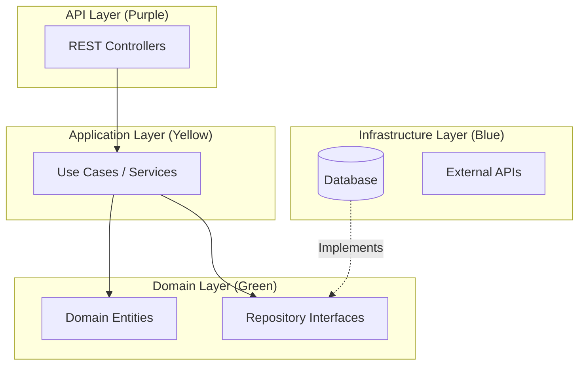

# Hexagonal Architecture Guide

This project follows **Hexagonal Architecture** (also known as _Ports and Adapters_). This guide explains strictly how the layers relate to each other and provides concrete examples of how data flows through the system.

## 🎯 The Core Concept

The main rule is **Dependencies point INWARDS**.

- The **Domain** is the center. It knows nothing about the database, the API, or the web.
- The **Application** wraps the domain.
- The **Infrastructure** and **API** wrap the application.



---

## 🏗️ The 4 Layers Explained

### 1. 🟢 Domain Layer (The "Brain")

- **Role:** Defines **WHAT** the business is. It contains the core logic that makes the application unique.
- **Rules:** Pure Java. No Frameworks. No Database annotations.
- **Contains:**
  - **Entities:** Objects with state and behavior (e.g., `User`, `Wallet`).
  - **Value Objects:** Immutable measurements (e.g., `Money`, `PhoneNumber`).
  - **Ports (Interfaces):** Contracts defining what data we need (e.g., `UserRepository`, `WalletRepository`), but not _how_ to get it.

### 2. 🟡 Application Layer (The "Manager")

- **Role:** Orchestrates **HOW** users interact with the domain. It handles specific "Use Cases".
- **Rules:** Orchestrates logic but doesn't contain core rules. Handles transactions.
- **Contains:**
  - **Use Cases:** Specific actions like `RegisterUserUseCase`, `TransferMoneyUseCase`.
  - **DTOs:** Data carriers (Records) that enter and exit the system.

### 3. 🔵 Infrastructure Layer (The "Plumbing")

- **Role:** Provides the **TOOLS** to make things happen. It connects the application to the real world.
- **Rules:** Implements the Domain Ports. Depends on heavy frameworks (Spring Data, Hibernate, AWS SDK).
- **Contains:**
  - **Persistence:** `UserJpaEntity`, `UserJpaRepository`.
  - **Adapters:** Implementations of domain interfaces (e.g., `UserRepositoryAdapter`).
  - **External Services:** `SmsSender`, `CloudStorageService`.

### 4. 🟣 API Layer (The "Interface")

- **Role:** The **DOOR** for the outside world.
- **Rules:** Handles HTTP logic only (JSON, Status Codes, Input Validation).
- **Contains:**
  - **Controllers:** `AuthController`, `WalletController`.
  - **Exception Handlers:** Translates errors into HTTP 400/500 responses.

---

## 🚀 Example 1: User Registration

_(This is what we implemented in Phase 1)_

**The Flow:**

1.  **🟣 API**: `AuthController` receives `POST /register`. Validates JSON. Calls `RegisterUserUseCase`.
2.  **🟡 Application**: `RegisterUserUseCase` checks if the phone exists. Hashes the password. Calls `User.createNew()`.
3.  **🟢 Domain**: `User` creates a new instance with valid default values (ACTIVE status, distinct UUID).
4.  **🟡 Application**: Calls `userRepository.save(user)`.
5.  **🔵 Infrastructure**: `UserRepositoryAdapter` converts the Domain `User` to `UserJpaEntity`. Saves it to PostgreSQL.

---

## 💸 Example 2: P2P Money Transfer

_(This is a future example for Phase 2)_

**Goal**: Move 1000 YER from User A to User B.

### 1. The Request (API Layer)

**`TransferController`** receives:

```json
{ "toUserId": "uuid-b", "amount": 1000, "currency": "YER" }
```

### 2. The Orchestration (Application Layer)

**`TransferMoneyUseCase`** does the following:

```java
@Transactional
public void execute(TransferRequest req) {
    // Load both wallets
    Wallet sender = walletRepository.findById(req.senderId());
    Wallet receiver = walletRepository.findById(req.receiverId());

    // Call Domain Logic
    sender.debit(req.amount());   // Throws exception if insufficient funds
    receiver.credit(req.amount());

    // Save state
    walletRepository.save(sender);
    walletRepository.save(receiver);
}
```

### 3. The Business Rules (Domain Layer)

**`Wallet.java`**:

```java
public void debit(BigDecimal amount) {
    if (this.balance.compareTo(amount) < 0) {
        throw new InsufficientFundsException();
    }
    this.balance = this.balance.subtract(amount);
}
```

### 4. The Persistence (Infrastructure Layer)

**`WalletRepositoryAdapter`** maps the updated `Wallet` domain object back to the `WalletJpaEntity` and updates the SQL table.

---

## 🛂 Example 3: KYC Document Upload

_(This involves external file storage)_

**Goal**: User uploads a passport photo.

1.  **🟣 API**: `KycController` receives the file bytes.
2.  **🟡 Application**: `UploadDocumentUseCase` asks the `FileStoragePort` to save the file.
3.  **🟢 Domain**: `KycVerification` entity updates its status to `PENDING_REVIEW` and records the file URL.
4.  **🔵 Infrastructure**:
    - `S3FileStorageAdapter` (implements `FileStoragePort`) uploads the actual image to AWS S3 / MinIO.
    - `KycRepositoryAdapter` saves the metadata to the database.

---

## ❓ Why so many files?

| If we put everything in... | The Problem                                                                                                                |
| -------------------------- | -------------------------------------------------------------------------------------------------------------------------- |
| **One Controller**         | "Fat Controller". Hard to test business logic without mocking HTTP. Hard to reuse logic (e.g., via CLI or Scheduled Task). |
| **One Service**            | "Anemic Domain". Data and logic are separated. The Service becomes a god-class 5000 lines long.                            |
| **One Domain Class**       | Database concerns (JPA annotations) mix with Business rules. Change the DB = Break the Business logic.                     |

**Hexagonal Architecture** separates these concerns so you can:

1.  Change the Database without rewriting the App.
2.  Test the Logic without starting a Server.
3.  Add a new Interface (e.g., Command Line) without touching the Core.
