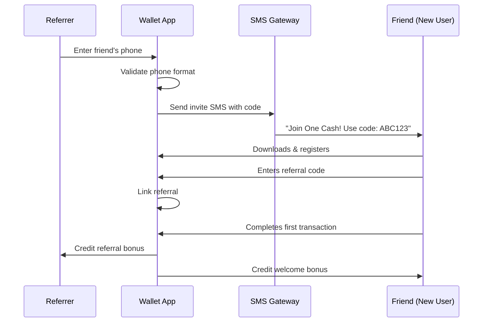
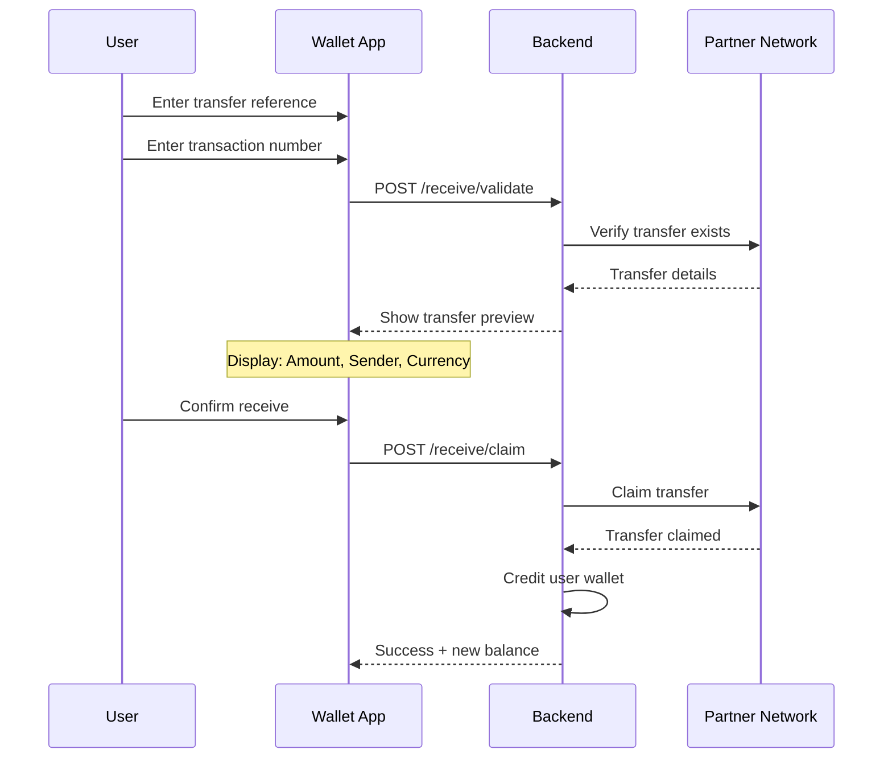

# 🏦 Complete Guide: Enterprise Digital Wallet System

> **A Beginner-Friendly, In-Depth Explanation of Building a Fintech Payment System**
>
> This guide explains everything from first principles - no prior knowledge required.

---

## 📋 Table of Contents

1. [What is a Digital Wallet? (Fintech Fundamentals)](#part-1-what-is-a-digital-wallet-fintech-fundamentals)
2. [Understanding Spring Boot (For Beginners)](#part-2-understanding-spring-boot-for-beginners)
3. [Security Deep Dive](#part-3-security-deep-dive)
   - [Threat Model & Mitigations](#35-threat-model--mitigations)
4. [Mathematical Precision in Finance](#part-4-mathematical-precision-in-finance)
5. [Software Engineering Principles](#part-5-software-engineering-principles)
6. [Feature Analysis: User & Identity Management](#part-6-feature-analysis-user--identity-management)
   - [KYC (Know Your Customer) Verification](#64-kyc-know-your-customer-verification)
7. [Feature Analysis: Device Binding & Security](#part-7-feature-analysis-device-binding--security)

8. [Feature Analysis: Wallet & Balance System](#part-8-feature-analysis-wallet--balance-system)
9. [Feature Analysis: Double-Entry Ledger](#part-9-feature-analysis-double-entry-ledger)
10. [Feature Analysis: P2P Transfer Engine](#part-10-feature-analysis-p2p-transfer-engine)
11. [Feature Analysis: Currency Exchange](#part-11-feature-analysis-currency-exchange)
12. [Database Design Rationale](#part-12-database-design-rationale)
13. [API Design Principles](#part-13-api-design-principles)
14. [Error Handling & Edge Cases](#part-14-error-handling--edge-cases)
15. [Testing Strategy](#part-15-testing-strategy)
16. [Admin Operations](#part-16-admin-operations)
17. [Limits Engine](#part-17-limits-engine)
18. [Audit & Reconciliation](#part-18-audit--reconciliation)
19. [API Catalog](#part-19-api-catalog)
20. [Observability & Production](#part-20-observability--production)
21. [Referral Program](#part-21-referral-program-دعوة-صديق)
22. [Privacy Settings](#part-22-privacy-settings-الخصوصية)
23. [Receive Transfers](#part-23-receive-transfers-استلام-حوالات)
24. [Multi-Language Support](#part-24-multi-language-support-تعدد-اللغات)
25. [Glossary](#glossary)

---

# Part 1: What is a Digital Wallet? (Fintech Fundamentals)

## 1.1 The Concept of a Wallet

Think of a **digital wallet** like a virtual version of your physical wallet, but with superpowers:

| Physical Wallet          | Digital Wallet                                     |
| ------------------------ | -------------------------------------------------- |
| Holds cash and cards     | Holds **balance records** in a database            |
| Can only be in one place | Accessible from anywhere with your phone           |
| If stolen, money is gone | Protected by passwords, biometrics, device binding |
| Manual counting          | Instant, precise calculations                      |
| Limited currencies       | Can hold multiple currencies simultaneously        |

## 1.2 How Money "Moves" in Digital Systems

**Important Concept**: Digital money doesn't physically move - we just update numbers in databases.

When you send $100 to a friend:

```
BEFORE:
┌─────────────────┐     ┌─────────────────┐
│  Your Account   │     │  Friend's Acct  │
│  Balance: $500  │     │  Balance: $200  │
└─────────────────┘     └─────────────────┘

AFTER:
┌─────────────────┐     ┌─────────────────┐
│  Your Account   │     │  Friend's Acct  │
│  Balance: $400  │     │  Balance: $300  │
└─────────────────┘     └─────────────────┘
```

**But here's the critical question**: What if the system crashes AFTER deducting from you but BEFORE adding to your friend?

This is why fintech systems are complex - they must guarantee **data integrity**.

## 1.3 Key Fintech Concepts

### ACID Properties (Database Guarantees)

| Property        | Meaning                      | Example                                 |
| --------------- | ---------------------------- | --------------------------------------- |
| **A**tomicity   | All or nothing               | Either BOTH accounts update, or NEITHER |
| **C**onsistency | Rules always valid           | Balance can never go negative           |
| **I**solation   | Transactions don't interfere | Two transfers can't conflict            |
| **D**urability  | Once done, it's permanent    | Survives server crashes                 |

### Idempotency

If you accidentally click "Send Money" twice (or your internet glitches and retries), the transaction should only happen **once**.

**Solution**: Each request has a unique ID. If we see the same ID twice, we ignore the duplicate.

### Float-Free Accounting

Banks don't use regular numbers (`float` or `double`). They use special **high-precision decimal** types because:

```
In programming:
0.1 + 0.1 + 0.1 = 0.30000000000000004  ← WRONG!

In banking (using BigDecimal):
0.1 + 0.1 + 0.1 = 0.3  ← CORRECT!
```

---

# Part 2: Understanding Spring Boot (For Beginners)

## 2.1 What is Spring Boot?

**Spring Boot** is a framework (toolkit) for building Java/Kotlin applications. Think of it as a "construction kit" that provides:

- Pre-built security systems
- Database connection tools
- Web server capabilities
- Configuration management

### Without Spring Boot:

```java
// You'd have to write 200+ lines to:
// - Start a web server
// - Handle HTTP requests
// - Connect to database
// - Manage security
```

### With Spring Boot:

```java
@SpringBootApplication
public class WalletApplication {

    public static void main(String[] args) {
        SpringApplication.run(WalletApplication.class, args);
    }
}
// That's it! Server is running.
```

## 2.2 Key Spring Boot Concepts

### Annotations (The @ symbols)

These are "labels" that tell Spring Boot what to do:

| Annotation        | Purpose                                    | Example         |
| ----------------- | ------------------------------------------ | --------------- |
| `@RestController` | "This class handles web requests"          | API endpoints   |
| `@Service`        | "This class contains business logic"       | Transfer logic  |
| `@Repository`     | "This class talks to the database"         | Save/load data  |
| `@Entity`         | "This class represents a database table"   | User, Wallet    |
| `@Transactional`  | "All of this must succeed or all rollback" | Money transfers |

### Dependency Injection (DI)

Instead of creating objects manually, Spring Boot "injects" them:

```java
// WITHOUT DI (messy):
public class TransferService {
    private WalletRepository walletRepo = new WalletRepository(
        new DatabaseConnection("localhost", "5432", "user", "pass"));
    private LedgerRepository ledgerRepo = new LedgerRepository(
        new DatabaseConnection("localhost", "5432", "user", "pass"));
}

// WITH DI (clean):
@Service
public class TransferService {
    private final WalletRepository walletRepo;  // Spring gives us this
    private final LedgerRepository ledgerRepo;  // Spring gives us this too

    public TransferService(WalletRepository walletRepo, LedgerRepository ledgerRepo) {
        this.walletRepo = walletRepo;
        this.ledgerRepo = ledgerRepo;
    }
}
```

## 2.3 Project Structure Overview

```
src/main/java/com/fintech/ewallet/
├── common/              ← Shared utilities (not business-specific)
│   ├── exception/       ← Custom error types
│   ├── config/          ← App configuration
│   └── util/            ← Helper functions
│
├── features/            ← Business modules (the meat of the app)
│   ├── auth/            ← Login, tokens, device binding
│   ├── wallet/          ← Balance management
│   ├── transaction/     ← Money movement
│   └── exchange/        ← Currency conversion
│
└── EwalletApplication.java  ← Entry point
```

---

# Part 3: Security Deep Dive

## 3.1 Authentication vs Authorization

| Concept            | Question It Answers | Example                                 |
| ------------------ | ------------------- | --------------------------------------- |
| **Authentication** | "WHO are you?"      | Login with phone + password             |
| **Authorization**  | "WHAT can you do?"  | Can view own balance, can't view others |

## 3.2 JWT (JSON Web Tokens)

JWTs are like digital ID cards that prove who you are.

### Structure of a JWT:

```
eyJhbGciOiJIUzI1NiIsInR5cCI6IkpXVCJ9.eyJ1c2VyX2lkIjoiMTIzNDU2Iiwi ZGV2aWNlX2lkIjoicGhvbmUtYWJjIiwiZXhwIjoxNzA3MjM0NTY3fQ.abc123signature
```

Split into 3 parts (separated by dots):

| Part          | Contains       | Decoded Example                                                      |
| ------------- | -------------- | -------------------------------------------------------------------- |
| **Header**    | Algorithm type | `{"alg": "HS256", "typ": "JWT"}`                                     |
| **Payload**   | User data      | `{"user_id": "123456", "device_id": "phone-abc", "exp": 1707234567}` |
| **Signature** | Verification   | Encrypted hash to prevent tampering                                  |

### Why JWTs for This Project:

1. **Stateless**: Server doesn't need to store session data
2. **Contains device_id**: We can verify the request comes from the registered device
3. **Expiry time**: Tokens auto-expire (usually 1 hour)

## 3.3 Device Binding (Fraud Prevention)

### The Problem:

Hackers might steal your password. If we only check password, they can steal your money.

### The Solution:

We tie your account to your **physical device** (phone).

```
Registration Flow:
┌──────────────┐         ┌─────────────┐
│   Your Phone │   ───►  │   Server    │
│ Device ID:   │         │             │
│ "ABC123XYZ"  │         │ Saves:      │
│              │         │ User + ABC  │
└──────────────┘         └─────────────┘

Login Attempt from Hacked Account:
┌──────────────┐         ┌─────────────┐
│ Hacker Phone │   ───►  │   Server    │
│ Device ID:   │         │             │
│ "HAC456KER"  │         │ "Wait!      │
│              │         │  Device ID  │
│ Password: ✓  │         │  mismatch!" │
└──────────────┘         └─────────────┘
                         ⬇️
                    Requires OTP
                    verification
```

### What is a Device ID?

A combination of hardware identifiers:

- Android ID (unique per device)
- Hardware serial number
- SIM card info (optional)

These create a **fingerprint** that's nearly impossible to fake.

## 3.4 Security Layers

```
Request Flow Through Security:

[Client] → [HTTPS/TLS] → [Rate Limiter] → [JWT Validator] → [Device Checker] → [Controller]
              │              │                  │                  │
              ▼              ▼                  ▼                  ▼
         Encryption     Max 100 req/min    Valid token?     Same device?
```

## 3.5 Threat Model & Mitigations

A **Threat Model** is a systematic way to identify potential security threats and plan defenses. This is what security engineers and interviewers look for!

### Threat Overview Table

| Threat                  | Risk Level  | Description                                     | Mitigation                                                 |
| ----------------------- | ----------- | ----------------------------------------------- | ---------------------------------------------------------- |
| **Account Takeover**    | 🔴 Critical | Attacker gains access to another user's account | Device binding + OTP for new devices + Strong passwords    |
| **Replay Attacks**      | 🔴 Critical | Attacker captures and resends a valid request   | Idempotency keys + Request timestamps + Nonce validation   |
| **Brute Force Login**   | 🟠 High     | Automated password guessing                     | Rate limiting + Account lockout after N failures           |
| **Insider/Admin Abuse** | 🟠 High     | Malicious admin manipulates balances            | Admin audit logs + Role-based access + 4-eyes principle    |
| **Data Breach**         | 🔴 Critical | Database leaked/stolen                          | Encryption at rest + Secrets management + Password hashing |
| **Man-in-the-Middle**   | 🟠 High     | Attacker intercepts communications              | TLS 1.3 + Certificate pinning in mobile app                |
| **SQL Injection**       | 🟠 High     | Malicious SQL in user input                     | Parameterized queries (JPA does this automatically)        |
| **Session Hijacking**   | 🟠 High     | Stealing JWT tokens                             | Short expiry + Refresh tokens + Device binding in token    |

### Deep Dive: Defense-in-Depth

The principle is: **Multiple layers of security**. If one fails, others still protect:

```
                    Attack Attempt
                          │
                          ▼
┌─────────────────────────────────────────────────────────────────────────┐
│ Layer 1: NETWORK LAYER                                                  │
│ ├── TLS 1.3 encryption (data in transit)                               │
│ ├── WAF (Web Application Firewall) blocks common attacks               │
│ └── DDoS protection                                                     │
└─────────────────────────────────────────────────────────────────────────┘
                          │ (If bypassed)
                          ▼
┌─────────────────────────────────────────────────────────────────────────┐
│ Layer 2: APPLICATION LAYER                                              │
│ ├── Rate limiting (100 requests/minute per IP)                         │
│ ├── Input validation (reject malformed data)                           │
│ └── CORS policy (only allowed origins)                                 │
└─────────────────────────────────────────────────────────────────────────┘
                          │ (If bypassed)
                          ▼
┌─────────────────────────────────────────────────────────────────────────┐
│ Layer 3: AUTHENTICATION LAYER                                           │
│ ├── JWT validation (signature, expiry, claims)                         │
│ ├── Device ID verification (matches token)                             │
│ └── Account lockout (5 failed attempts = 15 min lock)                  │
└─────────────────────────────────────────────────────────────────────────┘
                          │ (If bypassed)
                          ▼
┌─────────────────────────────────────────────────────────────────────────┐
│ Layer 4: AUTHORIZATION LAYER                                            │
│ ├── Role-based access (USER, ADMIN, SUPER_ADMIN)                       │
│ ├── Resource ownership check (user can only access own wallets)        │
│ └── Operation-specific permissions                                      │
└─────────────────────────────────────────────────────────────────────────┘
                          │ (If bypassed)
                          ▼
┌─────────────────────────────────────────────────────────────────────────┐
│ Layer 5: DATA LAYER                                                     │
│ ├── Encryption at rest (database encryption)                           │
│ ├── Sensitive data masking in logs                                     │
│ └── Audit trail (all changes logged immutably)                         │
└─────────────────────────────────────────────────────────────────────────┘
```

### Account Takeover Prevention Flow

```
Attacker has stolen password

    ┌──────────────────────────────────┐
    │ Step 1: Attacker tries to login  │
    │ Phone: "+967771234567"           │
    │ Password: "stolen_password" ✓    │
    │ Device: "attacker_phone"         │
    └──────────────────────────────────┘
                    │
                    ▼
    ┌──────────────────────────────────┐
    │ Step 2: Server checks device_id  │
    │                                  │
    │ Registered devices:              │
    │ - "victim_phone_abc123"          │
    │ - "victim_tablet_xyz789"         │
    │                                  │
    │ "attacker_phone" NOT in list!    │
    └──────────────────────────────────┘
                    │
                    ▼
    ┌──────────────────────────────────┐
    │ Step 3: Trigger OTP verification │
    │                                  │
    │ → Send OTP to victim's phone     │
    │ → Attacker doesn't receive it    │
    │ → Attack BLOCKED ✅              │
    └──────────────────────────────────┘
                    │
                    ▼
    ┌──────────────────────────────────┐
    │ Step 4: Alert the user           │
    │                                  │
    │ "Someone tried to access your    │
    │  account from a new device."     │
    │                                  │
    │ → User changes password          │
    └──────────────────────────────────┘
```

### Brute Force Protection

```java
// Rate Limiter Configuration
@Configuration
public class RateLimitConfig {
    @Bean
    public RateLimiter loginRateLimiter() {
        return RateLimiter.builder()
            .maxAttempts(5)                    // Max 5 attempts
            .windowDuration(Duration.ofMinutes(15))  // Per 15-minute window
            .lockoutDuration(Duration.ofMinutes(30)) // Lock for 30 min after
            .build();
    }
}

// Usage in login service
public LoginResult login(LoginRequest request) {
    // Check rate limit FIRST
    rateLimiter.checkLimit(request.getPhoneNumber());

    try {
        User user = authenticate(request);
        rateLimiter.resetOnSuccess(request.getPhoneNumber());
        return new LoginResult.Success(generateToken(user));
    } catch (InvalidCredentialsException e) {
        rateLimiter.recordFailure(request.getPhoneNumber());
        throw e;
    }
}
```

### Data Breach Mitigation

Even if database is stolen, attackers get:

| Data          | What's Stored               | What Attacker Gets                  |
| ------------- | --------------------------- | ----------------------------------- |
| Passwords     | BCrypt hash `$2a$12$X8k...` | Unusable - takes centuries to crack |
| Tokens        | JWT `eyJ...`                | Expired - short 1-hour TTL          |
| Phone Numbers | Plain `+967...`             | ⚠️ Exposed - consider encryption    |
| Balances      | Plain `50000.00`            | ⚠️ Exposed - consider encryption    |

**Production Improvement**: Encrypt sensitive columns with application-level encryption:

```java
@Entity
public class User {
    @Convert(converter = EncryptedStringConverter.class)
    private String phoneNumber;  // Stored encrypted in DB
}
```

---

# Part 4: Mathematical Precision in Finance

## 4.1 The Floating-Point Problem

### Why Regular Numbers Fail:

Computers store decimal numbers in binary (base 2). Some decimals can't be represented exactly:

```
Decimal: 0.1
Binary:  0.0001100110011001100110011... (repeating forever!)
```

This causes tiny errors that accumulate:

```java
// Using Double (BAD for money):
double balance = 0.0;
for (int i = 0; i < 1000; i++) {
    balance += 0.01;
}
System.out.println(balance);  // Output: 9.999999999999831 (NOT 10.00!)
```

### The Solution: BigDecimal

```java
// Using BigDecimal (CORRECT for money):
BigDecimal balance = BigDecimal.ZERO;
for (int i = 0; i < 1000; i++) {
    balance = balance.add(new BigDecimal("0.01"));
}
System.out.println(balance);  // Output: 10.00 (EXACT!)
```

## 4.2 Currency Precision Standards

Different currencies have different decimal places:

| Currency     | Code | Decimal Places | Example            |
| ------------ | ---- | -------------- | ------------------ |
| US Dollar    | USD  | 2              | $123.45            |
| Yemeni Rial  | YER  | 2              | 123.45 YER         |
| Bitcoin      | BTC  | 8              | 0.00000001 BTC     |
| Japanese Yen | JPY  | 0              | ¥123 (no decimals) |

We use `DECIMAL(19, 4)` in database to handle all these cases:

- 19 total digits
- 4 decimal places
- Supports up to: 999,999,999,999,999.9999

## 4.3 Rounding Rules

When dividing money (e.g., splitting a $100 transaction fee among 3 users), we need rules:

| Mode      | 33.33... becomes | Use Case                         |
| --------- | ---------------- | -------------------------------- |
| HALF_UP   | 33.34            | Standard rounding                |
| HALF_DOWN | 33.33            | Conservative                     |
| CEILING   | 33.34            | Always round up                  |
| FLOOR     | 33.33            | Always round down                |
| HALF_EVEN | 33.34            | Banker's rounding (reduces bias) |

### Banks typically use HALF_EVEN:

```java
BigDecimal amount = new BigDecimal("100.00");
BigDecimal threeWaySplit = amount.divide(new BigDecimal("3"), 2, RoundingMode.HALF_EVEN);
// Result: 33.33
// Remaining: 100.00 - (33.33 * 3) = 0.01 (goes to system)
```

## 4.4 Exchange Rate Mathematics

When converting currencies:

```
Amount in YER = Amount in SAR × Exchange Rate

Example:
100 SAR × 139.50 YER/SAR = 13,950 YER
```

**Challenge**: What if rate changes during the transaction?

**Solution**: Quote & Lock System

1. User requests a quote
2. Server locks the rate for 30 seconds
3. User confirms within 30 seconds
4. Transaction uses the locked rate

```java
public class ExchangeQuote {
    private UUID quoteId;
    private String fromCurrency;
    private String toCurrency;
    private BigDecimal rate;
    private Instant expiresAt;  // Created + 30 seconds

    // Constructor, getters, setters...
}
```

---

# Part 5: Software Engineering Principles

## 5.1 Clean Architecture

### The Dependency Rule

> Inner layers must NOT know about outer layers.

```
                    ┌─────────────────────────────┐
                    │      Presentation Layer     │
                    │  (Controllers, DTOs, Views) │
                    └──────────────┬──────────────┘
                                   ▼
                    ┌─────────────────────────────┐
                    │     Infrastructure Layer    │
                    │  (Database, External APIs)  │
                    └──────────────┬──────────────┘
                                   ▼
                    ┌─────────────────────────────┐
                    │     Application Layer       │
                    │  (Use Cases, Services)      │
                    └──────────────┬──────────────┘
                                   ▼
                    ┌─────────────────────────────┐
                    │       Domain Layer          │
                    │  (Entities, Business Rules) │
                    │      PURE - NO IMPORTS      │
                    └─────────────────────────────┘
```

### Why This Matters:

| If we want to...                | What we change | What stays the same |
| ------------------------------- | -------------- | ------------------- |
| Switch from PostgreSQL to MySQL | Infrastructure | Domain, Application |
| Add a mobile API                | Presentation   | Everything else     |
| Change fee calculation          | Domain         | Database, API       |
| Switch from REST to GraphQL     | Presentation   | Business logic      |

### Real Example:

```java
// DOMAIN LAYER (Pure Java, no Spring)
public interface WalletRepository {
    List<Wallet> findByUserId(UUID userId);
    Wallet save(Wallet wallet);
}

// INFRASTRUCTURE LAYER (Implements using Spring)
@Repository
public class JpaWalletRepository implements WalletRepository {
    private final SpringDataWalletRepository jpa;

    public JpaWalletRepository(SpringDataWalletRepository jpa) {
        this.jpa = jpa;
    }

    @Override
    public List<Wallet> findByUserId(UUID userId) {
        return jpa.findByUserId(userId);
    }

    @Override
    public Wallet save(Wallet wallet) {
        return jpa.save(wallet);
    }
}
```

The Domain layer doesn't know (or care) if we're using PostgreSQL, MongoDB, or a text file!

## 5.2 Domain-Driven Design (DDD)

### Key Concepts:

| Concept            | Definition                                  | Our Example                           |
| ------------------ | ------------------------------------------- | ------------------------------------- |
| **Entity**         | Object with identity                        | User (has unique ID)                  |
| **Value Object**   | Object without identity                     | Money (defined by amount + currency)  |
| **Aggregate**      | Cluster of entities treated as one          | Wallet + LedgerEntries                |
| **Aggregate Root** | Entry point to aggregate                    | Wallet is root, entries go through it |
| **Repository**     | Interface for persistence                   | WalletRepository                      |
| **Service**        | Business logic that doesn't fit in entities | TransferService                       |

### Example: Money as a Value Object

```java
// Value Object - immutable, compared by value not identity
public final class Money {
    private final BigDecimal amount;
    private final Currency currency;

    public Money(BigDecimal amount, Currency currency) {
        if (amount.compareTo(BigDecimal.ZERO) < 0) {
            throw new IllegalArgumentException("Amount cannot be negative");
        }
        this.amount = amount;
        this.currency = currency;
    }

    public Money add(Money other) {
        if (!this.currency.equals(other.currency)) {
            throw new IllegalArgumentException("Cannot add different currencies");
        }
        return new Money(this.amount.add(other.amount), this.currency);
    }

    public Money subtract(Money other) {
        if (!this.currency.equals(other.currency)) {
            throw new IllegalArgumentException("Cannot subtract different currencies");
        }
        if (this.amount.compareTo(other.amount) < 0) {
            throw new IllegalArgumentException("Insufficient funds");
        }
        return new Money(this.amount.subtract(other.amount), this.currency);
    }

    // Getters, equals, hashCode...
}
```

## 5.3 SOLID Principles Applied

### S - Single Responsibility

Each class does ONE thing:

- `TransferService` → Handles transfers
- `FeeCalculator` → Calculates fees
- `LedgerWriter` → Writes ledger entries

### O - Open/Closed

Open for extension, closed for modification:

```java
// We can add new fee strategies without changing existing code
public interface FeeStrategy {
    Money calculate(Money amount);
}

public class PercentageFee implements FeeStrategy { /* ... */ }
public class FlatFee implements FeeStrategy { /* ... */ }
public class TieredFee implements FeeStrategy { /* ... */ }
```

### L - Liskov Substitution

Subtypes must be substitutable for their base types.

### I - Interface Segregation

Many small interfaces > one big interface:

```java
public interface Debiteable { void debit(Money amount); }
public interface Creditable { void credit(Money amount); }
public interface Lockable { void lock(); }

// Wallet implements all three
// ReadOnlyWallet only implements what it needs
```

### D - Dependency Inversion

Depend on abstractions, not concretions:

```java
// BAD:
public class TransferService {
    private final PostgresWalletRepository postgresRepo; // Concrete class
}

// GOOD:
public class TransferService {
    private final WalletRepository walletRepo; // Interface - any implementation works
}
```

---

# Part 6: Feature Analysis: User & Identity Management

## 6.1 User Registration Flow

```
┌─────────────────────────────────────────────────────────────────────────┐
│                        USER REGISTRATION FLOW                            │
└─────────────────────────────────────────────────────────────────────────┘

[User] ─────► Phone Number: "+967771234567"
              Device ID: "android_abc123"
              Password: "SecurePass123!"
                    │
                    ▼
┌─────────────────────────────────────────────────────────────────────────┐
│                          VALIDATION LAYER                                │
│  ✓ Phone format valid?                                                   │
│  ✓ Phone not already registered?                                         │
│  ✓ Password meets requirements? (8+ chars, uppercase, number, symbol)   │
│  ✓ Device ID present and valid format?                                  │
└─────────────────────────────────────────────────────────────────────────┘
                    │
                    ▼ (All valid)
┌─────────────────────────────────────────────────────────────────────────┐
│                          BUSINESS LOGIC                                  │
│  1. Generate unique user ID (UUID)                                       │
│  2. Generate unique account number (e.g., "192967789")                  │
│  3. Hash password with BCrypt (never store plain text!)                 │
│  4. Create default wallets (YER, SAR, USD with 0 balance)               │
│  5. Register device as "trusted"                                         │
└─────────────────────────────────────────────────────────────────────────┘
                    │
                    ▼
┌─────────────────────────────────────────────────────────────────────────┐
│                          DATABASE (Single Transaction)                   │
│  INSERT INTO users → INSERT INTO user_devices → INSERT INTO wallets ×3 │
└─────────────────────────────────────────────────────────────────────────┘
```

## 6.2 Account Number Generation

### Requirements:

- Unique across all users
- Human-readable (9-10 digits)
- Includes check digit for typo detection

### Luhn Algorithm (Check Digit):

Used by credit cards, bank accounts, etc. to detect typos.

```
Account: 192967789

Step 1: Double every second digit from right:
1  9  2  9  6  7  7  8  9
      ×2    ×2    ×2    ×2
1  9  4  9  12 7  14 8  9

Step 2: If result > 9, subtract 9:
1  9  4  9  3  7  5  8  9

Step 3: Sum all digits:
1 + 9 + 4 + 9 + 3 + 7 + 5 + 8 + 9 = 55

Step 4: Check digit = (10 - (sum % 10)) % 10
Check digit = (10 - 5) % 10 = 5 ✓

If someone types 192967799 (swapped 8→9), the check fails!
```

## 6.3 Password Security

### Never Store Plain Passwords!

```java
// WRONG (extremely dangerous):
user.setPassword("user123");  // Stored as-is in database

// CORRECT (secure):
user.setPasswordHash(BCrypt.hashpw("user123", BCrypt.gensalt(12)));
// Stored: "$2a$12$LQv3c1y..."  (impossible to reverse)
```

### BCrypt Features:

1. **Salting**: Adds random data, so same password → different hash
2. **Cost Factor**: Makes brute-force attacks slow (2^12 iterations)
3. **One-way**: Mathematically impossible to reverse

## 6.4 KYC (Know Your Customer) Verification

### Why Mandatory KYC?

In fintech, **KYC (Know Your Customer)** is a regulatory requirement to:

- Prevent money laundering and terrorism financing
- Verify user identity before allowing financial transactions
- Comply with Central Bank regulations
- Reduce fraud and account takeover risks

### Our Approach: Mandatory KYC with Manual Review (MVP)

For the MVP, we implement **manual admin review** with architecture ready for future automated verification.

```
┌─────────────────────────────────────────────────────────────────────────┐
│                        KYC VERIFICATION FLOW                             │
└─────────────────────────────────────────────────────────────────────────┘

[User Opens App] ────► App checks: Has user completed KYC?
                              │
              ┌───────────────┴───────────────┐
              ▼                               ▼
         [NO KYC]                        [KYC APPROVED]
              │                               │
              ▼                               ▼
┌─────────────────────────┐         ┌─────────────────────────┐
│ Show KYC Upload Screen  │         │ Show Main Dashboard     │
│ (Cannot skip or bypass) │         │ (Full access to app)    │
└─────────────────────────┘         └─────────────────────────┘
```

### Step 1: Document Upload (Mobile App)

```
┌─────────────────────────────────────────────────────────────────────────┐
│                      KYC DOCUMENT UPLOAD SCREEN                          │
├─────────────────────────────────────────────────────────────────────────┤
│                                                                          │
│  📋 Step 1 of 3: Personal Information                                   │
│  ┌───────────────────────────────────────────────────────────────────┐  │
│  │ Full Name (Arabic):  [محمد أحمد علي                            ]  │  │
│  │ Full Name (English): [Mohammed Ahmed Ali                       ]  │  │
│  │ Date of Birth:       [1990-05-15                               ]  │  │
│  │ ID Type:             [◉ National ID  ○ Passport               ]  │  │
│  └───────────────────────────────────────────────────────────────────┘  │
│                                                                          │
│  📸 Step 2 of 3: Upload ID Document                                     │
│  ┌─────────────────────────┐  ┌─────────────────────────────────────┐  │
│  │                         │  │                                     │  │
│  │   [📷 ID Front Photo]   │  │   [📷 ID Back Photo]               │  │
│  │                         │  │                                     │  │
│  │   Tap to capture        │  │   Tap to capture                   │  │
│  └─────────────────────────┘  └─────────────────────────────────────┘  │
│                                                                          │
│  🤳 Step 3 of 3: Take a Selfie                                          │
│  ┌─────────────────────────────────────────────────────────────────┐    │
│  │                                                                   │    │
│  │            [📷 Live Selfie - Hold phone at eye level]            │    │
│  │                                                                   │    │
│  │    ⚠️ Photo must be taken NOW (not from gallery)                 │    │
│  │    ⚠️ Face must be clearly visible, good lighting                │    │
│  └─────────────────────────────────────────────────────────────────┘    │
│                                                                          │
│                        [✓ Submit for Review]                             │
│                                                                          │
└─────────────────────────────────────────────────────────────────────────┘
```

### Step 2: Data Validation & Storage

```java
public class KycSubmissionRequest {
    private String fullNameArabic;
    private String fullNameEnglish;
    private LocalDate dateOfBirth;
    private IdType idType;  // NATIONAL_ID, PASSPORT
    private byte[] idFrontImage;  // Base64 or multipart
    private byte[] idBackImage;  // Null for passport
    private byte[] selfieImage;

    // Constructor, getters, setters...
}

// Validation rules
public List<ValidationError> validateKycSubmission(KycSubmissionRequest request) {
    List<ValidationError> errors = new ArrayList<>();

    // Name validation
    if (request.getFullNameArabic() == null || request.getFullNameArabic().isBlank()) {
        errors.add(new ValidationError("fullNameArabic", "Arabic name is required"));
    }

    // Age validation (must be 18+)
    int age = Period.between(request.getDateOfBirth(), LocalDate.now()).getYears();
    if (age < 18) {
        errors.add(new ValidationError("dateOfBirth", "Must be at least 18 years old"));
    }

    // Image validation
    if (request.getIdFrontImage().length > 10_000_000) {  // 10MB max
        errors.add(new ValidationError("idFrontImage", "Image too large"));
    }

    // For National ID, back image is required
    if (request.getIdType() == IdType.NATIONAL_ID && request.getIdBackImage() == null) {
        errors.add(new ValidationError("idBackImage", "Back of ID required"));
    }

    return errors;
}
```

### Step 3: Secure Document Storage

> ⚠️ **CRITICAL: KYC documents are highly sensitive PII (Personally Identifiable Information)**

```
Document Storage Architecture:

┌────────────────────────────────────────────────────────────────────────────┐
│                            MAIN DATABASE                                    │
│  ┌────────────────────────────────────────────────────────────────────┐    │
│  │ kyc_verifications                                                   │    │
│  │ ├── id (UUID)                                                       │    │
│  │ ├── user_id (FK to users)                                          │    │
│  │ ├── status (PENDING_REVIEW, APPROVED, REJECTED)                    │    │
│  │ ├── full_name_arabic, full_name_english                            │    │
│  │ ├── date_of_birth, id_type                                         │    │
│  │ ├── id_front_path (reference to secure storage)    ──────┐         │    │
│  │ ├── id_back_path (reference to secure storage)     ──────┤         │    │
│  │ ├── selfie_path (reference to secure storage)      ──────┤         │    │
│  │ ├── rejection_reason (if rejected)                        │         │    │
│  │ ├── reviewed_by (admin ID)                                │         │    │
│  │ └── reviewed_at (timestamp)                               │         │    │
│  └───────────────────────────────────────────────────────────│─────────┘    │
└──────────────────────────────────────────────────────────────│──────────────┘
                                                               │
                                                               ▼
┌────────────────────────────────────────────────────────────────────────────┐
│                       SECURE FILE STORAGE                                   │
│  (Separate from main DB, encrypted at rest)                                │
│                                                                             │
│  /kyc-documents/                                                           │
│  ├── {user_id}/                                                            │
│  │   ├── id_front_{timestamp}.enc    (AES-256 encrypted)                  │
│  │   ├── id_back_{timestamp}.enc     (AES-256 encrypted)                  │
│  │   └── selfie_{timestamp}.enc      (AES-256 encrypted)                  │
│  │                                                                          │
│  Access: Only KYC admin role can decrypt and view                          │
│  Retention: Delete after 7 years (regulatory requirement)                  │
└────────────────────────────────────────────────────────────────────────────┘
```

### KYC Data Model

```java
public enum KycStatus {
    PENDING_UPLOAD,       // User started but didn't complete upload
    PENDING_REVIEW,       // Documents uploaded, waiting for admin
    APPROVED,             // Verified, full access granted
    REJECTED,             // Failed verification (fraud, unclear docs, etc.)
    RESUBMISSION_REQUIRED // Need clearer documents, can retry
}

public enum IdType {
    NATIONAL_ID,
    PASSPORT
}

public enum RejectionReason {
    DOCUMENT_UNCLEAR,         // Blurry or cut off
    DOCUMENT_EXPIRED,         // ID past expiry date
    FACE_MISMATCH,            // Selfie doesn't match ID photo
    DOCUMENT_TAMPERED,        // Signs of editing/forgery
    UNDERAGE,                 // User under 18
    DUPLICATE_ID,             // Same ID used by another account
    SELFIE_NOT_LIVE,          // Appears to be photo of a photo
    OTHER                     // Manual reason required
}

@Entity
@Table(name = "kyc_verifications")
public class KycVerification {
    @Id
    private UUID id = UUID.randomUUID();

    @Column(name = "user_id", nullable = false)
    private UUID userId;

    // User-provided information
    @Column(name = "full_name_arabic", nullable = false)
    private String fullNameArabic;

    @Column(name = "full_name_english")
    private String fullNameEnglish;

    @Column(name = "date_of_birth", nullable = false)
    private LocalDate dateOfBirth;

    @Enumerated(EnumType.STRING)
    @Column(name = "id_type", nullable = false)
    private IdType idType;

    // Secure storage paths (not actual images!)
    @Column(name = "id_front_path", nullable = false)
    private String idFrontPath;

    @Column(name = "id_back_path")
    private String idBackPath;

    @Column(name = "selfie_path", nullable = false)
    private String selfiePath;

    // Admin-extracted data (filled after review)
    @Column(name = "id_number")
    private String idNumber;

    @Column(name = "id_expiry_date")
    private LocalDate idExpiryDate;

    // Status tracking
    @Enumerated(EnumType.STRING)
    @Column(nullable = false)
    private KycStatus status = KycStatus.PENDING_REVIEW;

    @Enumerated(EnumType.STRING)
    @Column(name = "rejection_reason")
    private RejectionReason rejectionReason;

    @Column(name = "rejection_notes")
    private String rejectionNotes;  // Additional details

    @Column(name = "reviewed_by")
    private UUID reviewedBy;

    @Column(name = "reviewed_at")
    private Instant reviewedAt;

    @Column(name = "created_at", nullable = false)
    private Instant createdAt = Instant.now();

    @Column(name = "attempts", nullable = false)
    private int attempts = 1;  // Track resubmission count

    // Constructors, getters, setters...
}
```

### Step 4: Admin Review Dashboard

```
┌─────────────────────────────────────────────────────────────────────────┐
│                    KYC REVIEW DASHBOARD                                  │
├─────────────────────────────────────────────────────────────────────────┤
│                                                                          │
│  📊 Queue Status: 23 pending | 156 reviewed today | 2 flagged           │
│                                                                          │
├─────────────────────────────────────────────────────────────────────────┤
│                                                                          │
│  Current Review: KYC-2026-0001234                                        │
│                                                                          │
│  ┌─────────────────────────────────────────────────────────────────────┐│
│  │  User Info (from submission)                                        ││
│  │  ├── Name (Arabic): محمد أحمد علي                                   ││
│  │  ├── Name (English): Mohammed Ahmed Ali                             ││
│  │  ├── Date of Birth: 1990-05-15 (Age: 36)                           ││
│  │  ├── ID Type: National ID                                           ││
│  │  └── Submitted: 2026-02-07 10:30:00 (2 hours ago)                  ││
│  └─────────────────────────────────────────────────────────────────────┘│
│                                                                          │
│  ┌────────────────────┐ ┌────────────────────┐ ┌────────────────────┐   │
│  │                    │ │                    │ │                    │   │
│  │   ID FRONT         │ │   ID BACK          │ │   LIVE SELFIE      │   │
│  │   [Image View]     │ │   [Image View]     │ │   [Image View]     │   │
│  │                    │ │                    │ │                    │   │
│  │   🔍 Zoom          │ │   🔍 Zoom          │ │   🔍 Zoom          │   │
│  └────────────────────┘ └────────────────────┘ └────────────────────┘   │
│                                                                          │
│  ┌─────────────────────────────────────────────────────────────────────┐│
│  │  Admin Extracted Data (fill manually)                               ││
│  │  ├── ID Number: [_______________]                                   ││
│  │  ├── Expiry Date: [YYYY-MM-DD]                                      ││
│  │  └── Notes: [_________________________________]                     ││
│  └─────────────────────────────────────────────────────────────────────┘│
│                                                                          │
│  ┌─────────────────────────────────────────────────────────────────────┐│
│  │  Review Checklist:                                                  ││
│  │  □ ID document is clear and readable                                ││
│  │  □ ID is not expired                                                 ││
│  │  □ Face in selfie matches ID photo                                  ││
│  │  □ Selfie appears to be live (not photo of photo)                   ││
│  │  □ Name matches across documents                                     ││
│  │  □ User is 18 years or older                                        ││
│  └─────────────────────────────────────────────────────────────────────┘│
│                                                                          │
│  ┌──────────────────┐  ┌──────────────────┐  ┌──────────────────────┐   │
│  │  ✅ APPROVE      │  │  🔄 RESUBMIT     │  │  ❌ REJECT           │   │
│  └──────────────────┘  └──────────────────┘  └──────────────────────┘   │
│                                                                          │
└─────────────────────────────────────────────────────────────────────────┘
```

### Liveness Detection Tips (For Manual Review)

Without automated liveness detection, admins should look for:

| Check             | What to Look For                  | Red Flags 🚩                            |
| ----------------- | --------------------------------- | --------------------------------------- |
| **Screen glare**  | Natural lighting, no bright spots | Visible screen edges, rectangular glare |
| **Image quality** | Consistent quality with ID        | Selfie much lower quality than ID       |
| **3D features**   | Natural shadows on face           | Flat lighting, no depth                 |
| **Eyes**          | Looking at camera                 | Eyes looking at different angle         |
| **Background**    | Natural environment               | Blurred/edited background               |
| **Edges**         | Natural photo boundaries          | Cut edges, visible cropping             |

### Step 5: Status Notification

```java
// After admin review
fun notifyUserOfKycDecision(userId: UUID, decision: KycStatus, reason: RejectionReason?) {
    val user = userRepository.findById(userId)

    when (decision) {
        KycStatus.APPROVED -> {
            smsService.send(user.phoneNumber,
                "مرحباً! تم التحقق من هويتك بنجاح. يمكنك الآن استخدام جميع خدمات المحفظة."
            )
            // "Hello! Your identity has been verified. You can now use all wallet services."

            pushNotificationService.send(user.id,
                title = "KYC Approved ✅",
                body = "Your identity has been verified successfully!"
            )
        }

        KycStatus.REJECTED -> {
            val reasonText = when (reason) {
                RejectionReason.DOCUMENT_UNCLEAR -> "الوثيقة غير واضحة"
                RejectionReason.DOCUMENT_EXPIRED -> "الوثيقة منتهية الصلاحية"
                RejectionReason.FACE_MISMATCH -> "الصورة الشخصية لا تطابق صورة الهوية"
                else -> "يرجى التواصل مع خدمة العملاء"
            }

            smsService.send(user.phoneNumber,
                "عذراً، لم يتم قبول التحقق من الهوية. السبب: $reasonText"
            )
        }

        KycStatus.RESUBMISSION_REQUIRED -> {
            smsService.send(user.phoneNumber,
                "يرجى إعادة تحميل صور الهوية بجودة أفضل."
            )
        }
    }
}
```

### Updated Registration Flow (With KYC)

```
┌─────────────────────────────────────────────────────────────────────────┐
│                    COMPLETE REGISTRATION FLOW                            │
└─────────────────────────────────────────────────────────────────────────┘

Step 1: Phone Verification
        ├── User enters phone number
        ├── System sends OTP via SMS
        └── User enters OTP → Verified ✅
                │
                ▼
Step 2: Account Creation
        ├── User sets password
        ├── System creates user record
        └── Status: KYC_PENDING
                │
                ▼
Step 3: KYC Document Upload
        ├── User uploads ID (front + back)
        ├── User takes live selfie
        ├── User enters personal info
        └── Submission → Status: PENDING_REVIEW
                │
                ▼
Step 4: Admin Review (async)
        ├── Admin reviews documents
        ├── Admin approves/rejects
        └── User notified via SMS + Push
                │
        ┌───────┴───────┐
        ▼               ▼
   [APPROVED]      [REJECTED]
        │               │
        ▼               ▼
   Full access     Show reason
   to wallet       Allow retry
```

### Future Enhancement: Automated Verification

The architecture is designed to easily plug in 3rd party services:

```java
// Interface for KYC verification strategy
interface KycVerificationStrategy {
    fun verify(documents: KycDocuments): KycVerificationResult
}

// MVP: Manual review
class ManualKycVerification : KycVerificationStrategy {
    override fun verify(documents: KycDocuments): KycVerificationResult {
        // Store documents and queue for admin review
        kycRepository.save(documents.toEntity())
        return KycVerificationResult.PendingManualReview
    }
}

// Future: Jumio integration
class JumioKycVerification(
    private val jumioClient: JumioClient
) : KycVerificationStrategy {
    override fun verify(documents: KycDocuments): KycVerificationResult {
        val result = jumioClient.verify(
            idDocument = documents.idFront,
            selfie = documents.selfie
        )

        return when {
            result.confidence > 0.95 -> KycVerificationResult.AutoApproved(result.extractedData)
            result.confidence > 0.70 -> KycVerificationResult.PendingManualReview
            else -> KycVerificationResult.AutoRejected(result.reason)
        }
    }
}

// Future: Onfido integration
class OnfidoKycVerification(
    private val onfidoClient: OnfidoClient
) : KycVerificationStrategy {
    // Similar implementation...
}

// Service uses strategy pattern - easy to swap implementations
@Service
class KycService(
    private val verificationStrategy: KycVerificationStrategy  // Injected
) {
    fun submitKyc(request: KycSubmissionRequest): KycSubmissionResponse {
        val documents = processAndStoreDocuments(request)
        val result = verificationStrategy.verify(documents)
        return KycSubmissionResponse(result.status, result.message)
    }
}
```

### KYC Audit Trail

All KYC actions are logged for compliance:

```java
@Entity
@Table(name = "kyc_audit_logs")
class KycAuditLog(
    @Id val id: UUID = UUID.randomUUID(),
    val kycVerificationId: UUID,
    val action: String,      // SUBMITTED, REVIEWED, APPROVED, REJECTED, RESUBMITTED
    val actorId: UUID,       // User ID or Admin ID
    val actorType: String,   // USER, ADMIN
    val previousStatus: KycStatus?,
    val newStatus: KycStatus,
    val details: String?,    // JSON with additional info
    val ipAddress: String?,
    val timestamp: Instant = Instant.now()
)
```

---

# Part 7: Feature Analysis: Device Binding & Security

## 7.1 Why Device Binding?

### Threat Model:

| Attack Type                  | Without Device Binding      | With Device Binding           |
| ---------------------------- | --------------------------- | ----------------------------- |
| Password stolen via phishing | ❌ Full access              | ✅ Blocked (wrong device)     |
| SIM swap attack              | ❌ Can receive OTP          | ✅ Device check fails first   |
| Database breach              | ❌ Hashed passwords cracked | ✅ Still need physical device |

## 7.2 Device Fingerprinting

### What We Collect:

```java
data class DeviceFingerprint(
    val androidId: String,           // Unique per device+app
    val hardwareSerial: String,      // Physical device ID
    val buildFingerprint: String,    // ROM/OS identifier
    val screenResolution: String,    // "1080x2400"
    val installedApps: List<String>  // Optional, privacy-respecting
)

// Combined hash:
val deviceId = sha256(
    "$androidId:$hardwareSerial:$buildFingerprint"
)
// Result: "abc123xyz..." (unique identifier)
```

## 7.3 Multi-Device Support

Users may have multiple devices (phone + tablet):

```
User: "Mustafa"
├── Device 1: "phone-abc123" (Trusted) ✅
├── Device 2: "tablet-xyz789" (Trusted) ✅
└── Device 3: "unknown-hacker" (Untrusted) ❌

Database: user_devices table
┌──────────┬────────────────┬────────────┐
│ user_id  │  device_id     │ is_trusted │
├──────────┼────────────────┼────────────┤
│ mustafa  │ phone-abc123   │ TRUE       │
│ mustafa  │ tablet-xyz789  │ TRUE       │
└──────────┴────────────────┴────────────┘
```

## 7.4 New Device Login Flow

```
┌─────────────────────────────────────────────────────────────────────────┐
│                    NEW DEVICE LOGIN FLOW                                 │
└─────────────────────────────────────────────────────────────────────────┘

[New Device] ──► Login Request
                  Phone: "+967771234567"
                  Password: "correct"
                  Device ID: "new-phone-999"
                        │
                        ▼
┌───────────────────────────────────────────────┐
│ Step 1: Verify Credentials                    │
│ ✓ Phone exists?                               │
│ ✓ Password matches hash?                      │
└───────────────────────────────────────────────┘
                        │
                        ▼
┌───────────────────────────────────────────────┐
│ Step 2: Check Device                          │
│ Is "new-phone-999" in user_devices?           │
│ Answer: NO                                    │
└───────────────────────────────────────────────┘
                        │
                        ▼
┌───────────────────────────────────────────────┐
│ Step 3: Require Additional Verification       │
│ ► Send OTP to registered phone                │
│ ► Or email verification                       │
│ ► Or answer security questions                │
└───────────────────────────────────────────────┘
                        │
                        ▼ (OTP verified)
┌───────────────────────────────────────────────┐
│ Step 4: Register New Device                   │
│ INSERT INTO user_devices                      │
│ (user_id, "new-phone-999", TRUE)              │
└───────────────────────────────────────────────┘
                        │
                        ▼
┌───────────────────────────────────────────────┐
│ Step 5: Issue JWT with device_id              │
│ Token contains: user_id + device_id + expiry  │
└───────────────────────────────────────────────┘
```

---

# Part 8: Feature Analysis: Wallet & Balance System

## 8.1 One User, Multiple Wallets

### Design Philosophy:

Each currency has its own wallet. This prevents accidental mixing of currencies.

```
User: "Mustafa"
├── Wallet 1: YER (Yemeni Rial)  → Balance: 50,000.00
├── Wallet 2: SAR (Saudi Riyal)  → Balance: 200.00
└── Wallet 3: USD (US Dollar)    → Balance: 0.00

Benefits:
✓ Clear separation
✓ Each follows its currency's precision rules
✓ Easy to add new currencies
✓ Regulatory compliance (some countries require separation)
```

## 8.2 System Wallets

The system itself has wallets for accounting purposes:

| System Wallet   | Purpose                     |
| --------------- | --------------------------- |
| `LIQUIDITY_YER` | Holds all YER in the system |
| `LIQUIDITY_SAR` | Holds all SAR in the system |
| `LIQUIDITY_USD` | Holds all USD in the system |
| `FEES_YER`      | Collected fees in YER       |
| `FEES_SAR`      | Collected fees in SAR       |
| `FEES_USD`      | Collected fees in USD       |

### Zero-Sum Rule:

```
Sum of all user balances + Sum of all system balances = 0

This means: Money never appears or disappears - it only moves.

Example:
- Users have total: +1,000,000 YER
- System liquidity has: -1,000,000 YER (liability to users)
- Net: 0 ✓
```

## 8.3 Balance Caching Strategy

This is a **critical performance optimization** in fintech systems. Understanding this pattern is valuable for interviews and real-world systems!

### The Core Problem: Performance vs. Accuracy

Imagine a user has made 10,000 transactions over 3 years. Every time they open the app to check their balance:

```sql
-- This query reads ALL 10,000 ledger entries!
SELECT SUM(amount) FROM ledger_entries WHERE wallet_id = 'abc123';

-- Result: 50,000.00 YER (correct, but SLOW!)
```

#### Performance Impact Without Caching:

| Transactions | Query Time | User Experience     |
| ------------ | ---------- | ------------------- |
| 100          | ~5ms       | ✅ Fast             |
| 1,000        | ~50ms      | ⚠️ Noticeable delay |
| 10,000       | ~500ms     | ❌ Slow             |
| 100,000      | ~5 seconds | 💀 Unusable         |

**Problem**: The more history you have, the slower it gets!

### The Solution: Cached Balance with Source of Truth

We store the balance in **two places**:

```
┌─────────────────────────────────────────────────────────────────────────┐
│                         WALLETS TABLE (Cache)                            │
├─────────────────────────────────────────────────────────────────────────┤
│  id: "wallet_abc123"                                                     │
│  user_id: "user_xyz"                                                     │
│  currency: "YER"                                                         │
│  balance: 50,000.00  ◄─── CACHED VALUE (fast reads!)                    │
└─────────────────────────────────────────────────────────────────────────┘
                                    │
                                    │ Must always equal ↓
                                    ▼
┌─────────────────────────────────────────────────────────────────────────┐
│                    LEDGER_ENTRIES TABLE (Source of Truth)                │
├─────────────────────────────────────────────────────────────────────────┤
│  Entry 1: +100,000.00 (Initial deposit)                                  │
│  Entry 2: -20,000.00  (Transfer to friend)                              │
│  Entry 3: -10,000.00  (Bill payment)                                    │
│  Entry 4: -500.00     (Fee)                                              │
│  Entry 5: +5,000.00   (Received from friend)                            │
│  ... (thousands more entries)                                            │
│  ─────────────────────────────────────────────────────────────────────  │
│  SUM = 50,000.00  ◄─── CALCULATED VALUE (slow but accurate!)            │
└─────────────────────────────────────────────────────────────────────────┘
```

### The Write Path (How We Update)

When a transaction happens, we update **BOTH** in a **single atomic transaction**:

```java
@Transactional  // ← Critical! All or nothing!
fun transfer(fromWallet: UUID, toWallet: UUID, amount: BigDecimal) {

    // Step 1: Create ledger entries (Source of Truth)
    ledgerRepository.save(LedgerEntry(
        walletId = fromWallet,
        amount = amount.negate(),  // -1000
        type = EntryType.DEBIT
    ))

    ledgerRepository.save(LedgerEntry(
        walletId = toWallet,
        amount = amount,           // +1000
        type = EntryType.CREDIT
    ))

    // Step 2: Update cached balances
    walletRepository.updateBalance(fromWallet, amount.negate())  // -= 1000
    walletRepository.updateBalance(toWallet, amount)             // += 1000

    // Both happen atomically - if one fails, both rollback!
}
```

#### Visual Flow of a Transfer

```
Before Transfer:
┌──────────────────┐      ┌──────────────────┐
│ Alice's Wallet   │      │ Bob's Wallet     │
│ Balance: 10,000  │      │ Balance: 5,000   │
└──────────────────┘      └──────────────────┘

Transfer: Alice → Bob (1,000 YER)

┌─────────────────────────────────────────────────────────────────────────┐
│                    ATOMIC TRANSACTION (All or Nothing)                   │
│                                                                          │
│  1. INSERT INTO ledger_entries (Alice, -1000)  ✓                        │
│  2. INSERT INTO ledger_entries (Bob, +1000)    ✓                        │
│  3. UPDATE wallets SET balance = 9,000 WHERE id = Alice  ✓              │
│  4. UPDATE wallets SET balance = 6,000 WHERE id = Bob    ✓              │
│                                                                          │
│  COMMIT ✓                                                                │
└─────────────────────────────────────────────────────────────────────────┘

After Transfer:
┌──────────────────┐      ┌──────────────────┐
│ Alice's Wallet   │      │ Bob's Wallet     │
│ Balance: 9,000   │      │ Balance: 6,000   │
└──────────────────┘      └──────────────────┘
```

### The Read Path (How We Fetch Balance)

When user opens the app:

```java
fun getBalance(walletId: UUID): BigDecimal {
    // Just read from wallets table - O(1) lookup!
    return walletRepository.findById(walletId).balance

    // NOT this (slow):
    // return ledgerRepository.sumByWalletId(walletId)
}
```

```sql
-- Fast read (indexed, single row):
SELECT balance FROM wallets WHERE id = 'wallet_abc123';
-- Result in ~1ms regardless of transaction history!
```

### The Safety Net: Reconciliation

**The key insight**: Cached values can become wrong due to:

- Bugs in code
- Failed transactions
- Direct database edits
- Concurrency issues

So we **verify** regularly (see Part 18 for full details):

```java
@Scheduled(cron = "0 0 */4 * * *")  // Every 4 hours
fun reconcileBalances() {

    // Query: Find any wallet where cache ≠ calculated
    val discrepancies = jdbcTemplate.query("""
        SELECT
            w.id,
            w.balance as cached_balance,
            COALESCE(SUM(le.amount), 0) as calculated_balance
        FROM wallets w
        LEFT JOIN ledger_entries le ON w.id = le.wallet_id
        GROUP BY w.id, w.balance
        HAVING w.balance != COALESCE(SUM(le.amount), 0)
    """)

    if (discrepancies.isEmpty()) {
        log.info("✅ Reconciliation passed - all balances match!")
    } else {
        log.error("🚨 ALERT: ${discrepancies.size} balance mismatches found!")
        alertService.sendCriticalAlert(discrepancies)
    }
}
```

#### Reconciliation Visualization

```
Reconciliation Check:

Wallet "alice_123":
┌─────────────────────────────────────────────────────────────────────────┐
│ Cached Balance (wallets.balance):     50,000.00 YER                     │
│ Calculated Balance (SUM of ledger):   50,000.00 YER                     │
│ Difference:                            0.00 ✅                          │
└─────────────────────────────────────────────────────────────────────────┘

Wallet "bob_456":
┌─────────────────────────────────────────────────────────────────────────┐
│ Cached Balance (wallets.balance):     30,000.00 YER                     │
│ Calculated Balance (SUM of ledger):   30,000.00 YER                     │
│ Difference:                            0.00 ✅                          │
└─────────────────────────────────────────────────────────────────────────┘

Wallet "charlie_789":
┌─────────────────────────────────────────────────────────────────────────┐
│ Cached Balance (wallets.balance):     25,000.00 YER                     │
│ Calculated Balance (SUM of ledger):   24,500.00 YER                     │
│ Difference:                             500.00 🚨 MISMATCH!             │
│                                                                          │
│ ACTION: Freeze wallet, investigate, alert on-call engineer              │
└─────────────────────────────────────────────────────────────────────────┘
```

### Why This Design Works

| Concern          | Solution                                |
| ---------------- | --------------------------------------- |
| **Speed**        | Read cached `balance` column (~1ms)     |
| **Accuracy**     | `ledger_entries` is the source of truth |
| **Auditability** | Every change is recorded in ledger      |
| **Safety**       | Reconciliation catches any drift        |
| **Atomicity**    | Single transaction updates both         |

### What Can Go Wrong?

| Issue             | Cause               | Prevention                                                             |
| ----------------- | ------------------- | ---------------------------------------------------------------------- |
| Cache out of sync | Bug in code         | Always use `@Transactional`, never update balance without ledger entry |
| Double counting   | Concurrent requests | Use pessimistic or optimistic locking (see 8.4)                        |
| Missing update    | Partial failure     | `@Transactional` ensures all-or-nothing                                |
| Direct DB edit    | Admin mistake       | Restrict DB access, use admin API instead                              |

## 8.4 Optimistic vs Pessimistic Locking

### The Race Condition Problem:

```
Time    User sends 2 requests simultaneously:
────────────────────────────────────────────────
 T1     Request A reads balance: 100
 T2     Request B reads balance: 100
 T3     Request A: 100 - 80 = 20, saves 20
 T4     Request B: 100 - 80 = 20, saves 20  ← WRONG!

Result: User spent 160 from 100 balance! 💀
```

### Solution 1: Optimistic Locking

```java
@Entity
class Wallet {
    @Version
    var version: Long = 0  // Auto-incremented on each update
}

// Transaction A reads version=5
// Transaction B reads version=5
// Transaction A saves, version becomes 6
// Transaction B tries to save with version=5 → REJECTED! Retry needed.
```

**Use when**: Conflicts are rare (general user accounts)

### Solution 2: Pessimistic Locking

```java
@Query("SELECT w FROM Wallet w WHERE w.id = :id")
@Lock(LockModeType.PESSIMISTIC_WRITE)
fun findByIdForUpdate(id: UUID): Wallet?

// This generates: SELECT ... FOR UPDATE
// Other transactions must WAIT until this one completes
```

**Use when**: Conflicts are frequent (system wallets, popular accounts)

---

# Part 9: Feature Analysis: Double-Entry Ledger

## 9.1 What is Double-Entry Bookkeeping?

Every transaction has TWO entries that balance each other:

```
Transfer: Mustafa sends 100 YER to Ahmed

Entry 1 (Debit):
  Wallet: Mustafa-YER
  Amount: -100.00
  Type: DEBIT

Entry 2 (Credit):
  Wallet: Ahmed-YER
  Amount: +100.00
  Type: CREDIT

Sum of entries = -100 + 100 = 0 ✓ (Always!)
```

## 9.2 Why Not Just One Balance Field?

### Single Balance (Dangerous):

```sql
UPDATE wallets SET balance = balance - 100 WHERE user_id = 'mustafa';
UPDATE wallets SET balance = balance + 100 WHERE user_id = 'ahmed';
```

Problems:

- No audit trail (what happened yesterday?)
- Hard to debug issues
- Regulators require full history
- If update #2 fails, money vanishes

### Double-Entry Ledger (Safe):

```sql
INSERT INTO ledger_entries (wallet_id, amount, type) VALUES ('mustafa-yer', -100, 'DEBIT');
INSERT INTO ledger_entries (wallet_id, amount, type) VALUES ('ahmed-yer', +100, 'CREDIT');
UPDATE wallets SET balance = balance - 100 WHERE id = 'mustafa-yer';
UPDATE wallets SET balance = balance + 100 WHERE id = 'ahmed-yer';
-- All 4 statements in ONE transaction (all or nothing)
```

Benefits:

- Complete history forever
- Any balance can be recalculated from entries
- Regulators can audit
- Easy to reverse transactions

## 9.3 Ledger Entry Structure

```java
@Entity
@Table(name = "ledger_entries")
class LedgerEntry(
    @Id
    val id: UUID = UUID.randomUUID(),

    @ManyToOne
    val transaction: Transaction,  // Parent transaction

    @ManyToOne
    val wallet: Wallet,            // Which wallet affected

    val amount: BigDecimal,        // Positive (credit) or Negative (debit)

    val balanceAfter: BigDecimal,  // Wallet balance after this entry

    @Enumerated(EnumType.STRING)
    val type: EntryType,           // DEBIT or CREDIT

    val createdAt: Instant = Instant.now()
)

enum class EntryType {
    DEBIT,   // Money going OUT
    CREDIT   // Money coming IN
}
```

## 9.4 Example: Transfer with Fee

```
Mustafa sends 1000 YER to Ahmed
Fee: 20 YER (2%)

Ledger Entries Created:

┌────────────────────────────────────────────────────────────────────┐
│ Transaction: tx_abc123                                             │
├────────────────────────────────────────────────────────────────────┤
│ Entry 1: Mustafa-YER | -1020.00 | DEBIT   | Balance: 48,980       │
│ Entry 2: Ahmed-YER   | +1000.00 | CREDIT  | Balance: 6,000        │
│ Entry 3: FEES_YER    | +20.00   | CREDIT  | Balance: 1,520        │
├────────────────────────────────────────────────────────────────────┤
│ Sum: -1020 + 1000 + 20 = 0 ✓                                      │
└────────────────────────────────────────────────────────────────────┘
```

---

# Part 10: Feature Analysis: P2P Transfer Engine

## 10.1 Transfer Request Lifecycle

```
         ┌─────────────────────────────────────────────────────────────┐
         │                 TRANSFER REQUEST LIFECYCLE                   │
         └─────────────────────────────────────────────────────────────┘

┌─────────┐    ┌──────────┐    ┌───────────┐    ┌───────────┐    ┌──────────┐
│INITIATED│───►│VALIDATING│───►│PROCESSING │───►│ COMPLETED │    │ REVERSED │
└─────────┘    └──────────┘    └───────────┘    └───────────┘    └──────────┘
     │              │               │                                  ▲
     │              │               │                                  │
     ▼              ▼               ▼                                  │
┌─────────────────────────────────────────────────────────────────────────────┐
│ FAILED (with reason)                                                        │
│ - Insufficient funds                                                        │
│ - Recipient not found                                                       │
│ - Daily limit exceeded                                                      │
│ - Account frozen                                                            │
└─────────────────────────────────────────────────────────────────────────────┘
```

### 10.1.1 User Flow: Preview & Confirm Pattern

This is the step-by-step flow the user experiences when sending money:

```
┌─────────────────────────────────────────────────────────────────────────┐
│                     P2P TRANSFER USER FLOW                               │
└─────────────────────────────────────────────────────────────────────────┘

┌─────────────────────────────────────────────────────────────────────────┐
│  STEP 1: ENTER RECIPIENT                                                │
├─────────────────────────────────────────────────────────────────────────┤
│                                                                          │
│  📱 TRANSFER MONEY                                                       │
│                                                                          │
│  Recipient Account Number or Phone:                                      │
│  ┌──────────────────────────────────────────────────────────────────┐   │
│  │  967771234567                                                     │   │
│  └──────────────────────────────────────────────────────────────────┘   │
│                                                                          │
│                            [Continue →]                                  │
│                                                                          │
└─────────────────────────────────────────────────────────────────────────┘
                                    │
                                    ▼
┌─────────────────────────────────────────────────────────────────────────┐
│  STEP 2: SELECT CURRENCY & AMOUNT                                       │
├─────────────────────────────────────────────────────────────────────────┤
│                                                                          │
│  📱 TRANSFER MONEY                                                       │
│                                                                          │
│  Currency:                                                               │
│  ┌──────────────────────────────────────────────────────────────────┐   │
│  │  [◉ YER]  [○ SAR]  [○ USD]                                       │   │
│  └──────────────────────────────────────────────────────────────────┘   │
│                                                                          │
│  Amount:                                                                 │
│  ┌──────────────────────────────────────────────────────────────────┐   │
│  │  1,000.00                                                         │   │
│  └──────────────────────────────────────────────────────────────────┘   │
│                                                                          │
│  Your Balance: 50,000.00 YER                                            │
│                                                                          │
│                            [Continue →]                                  │
│                                                                          │
└─────────────────────────────────────────────────────────────────────────┘
                                    │
                                    ▼
┌─────────────────────────────────────────────────────────────────────────┐
│  STEP 3: PREVIEW & CONFIRM (CRITICAL!)                                  │
├─────────────────────────────────────────────────────────────────────────┤
│                                                                          │
│  📱 CONFIRM TRANSFER                                                     │
│                                                                          │
│  ┌────────────────────────────────────────────────────────────────────┐ │
│  │                                                                     │ │
│  │  You are sending to:                                               │ │
│  │                                                                     │ │
│  │  👤 Mohammed Ahmed Ali                ◄── RECIPIENT NAME SHOWN!   │ │
│  │     +967 77 *** 4567                                               │ │
│  │                                                                     │ │
│  └────────────────────────────────────────────────────────────────────┘ │
│                                                                          │
│  Amount:              1,000.00 YER                                       │
│  Fee (2%):               20.00 YER                                       │
│  ─────────────────────────────────                                       │
│  Total Debit:         1,020.00 YER                                       │
│                                                                          │
│  ⚠️ Please verify the recipient name before confirming                  │
│                                                                          │
│         [← Back]              [✓ Confirm & Send]                        │
│                                                                          │
└─────────────────────────────────────────────────────────────────────────┘
                                    │
                                    ▼
┌─────────────────────────────────────────────────────────────────────────┐
│  STEP 4: SUCCESS                                                        │
├─────────────────────────────────────────────────────────────────────────┤
│                                                                          │
│  📱 TRANSFER COMPLETE ✅                                                 │
│                                                                          │
│  You sent 1,000.00 YER to                                               │
│  Mohammed Ahmed Ali                                                      │
│                                                                          │
│  Reference: P2P-2026-0001234                                            │
│  Date: 2026-02-07 19:44                                                  │
│                                                                          │
│              [🏠 Home]    [📄 Receipt]                                   │
│                                                                          │
└─────────────────────────────────────────────────────────────────────────┘
```

### 10.1.2 Backend API Flow

```
┌─────────────────────────────────────────────────────────────────────────┐
│                        API CALLS BEHIND THE SCENES                       │
└─────────────────────────────────────────────────────────────────────────┘

Step 1-2: User enters recipient, currency, and amount
          │
          ▼
┌───────────────────────────────────────────────────────────────────────────┐
│ POST /api/transfers/preview                                               │
│ {                                                                         │
│   "recipientIdentifier": "967771234567",  // Phone or account number     │
│   "currency": "YER",                                                      │
│   "amount": 1000.00                                                       │
│ }                                                                         │
└───────────────────────────────────────────────────────────────────────────┘
          │
          ▼
┌───────────────────────────────────────────────────────────────────────────┐
│ Response: 200 OK                                                          │
│ {                                                                         │
│   "previewId": "prev_abc123",           // Valid for 5 minutes           │
│   "recipient": {                                                          │
│     "name": "Mohammed Ahmed Ali",       // ← NAME RETURNED FOR DISPLAY   │
│     "maskedPhone": "+967 77 *** 4567"   // Partially masked for privacy  │
│   },                                                                      │
│   "amount": 1000.00,                                                      │
│   "fee": 20.00,                                                           │
│   "totalDebit": 1020.00,                                                  │
│   "currency": "YER",                                                      │
│   "senderBalanceAfter": 48980.00                                          │
│ }                                                                         │
└───────────────────────────────────────────────────────────────────────────┘
          │
          ▼ (User sees name, clicks Confirm)
          │
┌───────────────────────────────────────────────────────────────────────────┐
│ POST /api/transfers/execute                                               │
│ Headers: Idempotency-Key: "user123-txn-1707321600000"                    │
│ {                                                                         │
│   "previewId": "prev_abc123"            // Reference the preview         │
│ }                                                                         │
└───────────────────────────────────────────────────────────────────────────┘
          │
          ▼
┌───────────────────────────────────────────────────────────────────────────┐
│ Response: 200 OK                                                          │
│ {                                                                         │
│   "transactionId": "550e8400-...",                                       │
│   "referenceId": "P2P-2026-0001234",                                     │
│   "status": "COMPLETED",                                                  │
│   "completedAt": "2026-02-07T19:44:12Z"                                   │
│ }                                                                         │
└───────────────────────────────────────────────────────────────────────────┘
```

### 10.1.3 Preview Service Implementation

```java
@Service
class TransferPreviewService(
    private val userRepository: UserRepository,
    private val walletRepository: WalletRepository,
    private val feeCalculator: FeeCalculator,
    private val previewStore: PreviewStore  // Redis or in-memory cache
) {
    fun createPreview(request: PreviewRequest): PreviewResponse {
        // Step 1: Find recipient by phone or account number
        val recipient = userRepository.findByPhoneOrAccountNumber(
            request.recipientIdentifier
        ) ?: throw RecipientNotFoundException()

        // Step 2: Verify sender has sufficient balance
        val senderWallet = walletRepository.findByUserAndCurrency(
            request.senderId, request.currency
        ) ?: throw WalletNotFoundException()

        val fee = feeCalculator.calculate(request.amount, request.currency)
        val totalDebit = request.amount + fee

        if (senderWallet.balance < totalDebit) {
            throw InsufficientBalanceException()
        }

        // Step 3: Create preview (valid for 5 minutes)
        val preview = TransferPreview(
            id = "prev_${UUID.randomUUID().toString().take(8)}",
            senderId = request.senderId,
            recipientId = recipient.id,
            recipientName = recipient.fullName,           // ← The key field!
            recipientPhone = maskPhone(recipient.phone),  // Privacy
            amount = request.amount,
            fee = fee,
            totalDebit = totalDebit,
            currency = request.currency,
            expiresAt = Instant.now().plus(5, ChronoUnit.MINUTES)
        )

        previewStore.save(preview)  // Store in Redis with TTL

        return PreviewResponse(
            previewId = preview.id,
            recipient = RecipientInfo(
                name = preview.recipientName,
                maskedPhone = preview.recipientPhone
            ),
            amount = preview.amount,
            fee = preview.fee,
            totalDebit = preview.totalDebit,
            currency = preview.currency,
            senderBalanceAfter = senderWallet.balance - totalDebit
        )
    }

    private fun maskPhone(phone: String): String {
        // "+967771234567" → "+967 77 *** 4567"
        return "${phone.take(7)} *** ${phone.takeLast(4)}"
    }
}
```

### 10.1.4 Why This Two-Step Process?

| Step             | Purpose                    | Security Benefit                  |
| ---------------- | -------------------------- | --------------------------------- |
| **Preview**      | Show recipient name        | Prevents sending to wrong person  |
| **Confirm**      | User explicitly approves   | No "accidental" transfers         |
| **Preview ID**   | Links preview to execution | Can't modify amount after preview |
| **Time limit**   | Preview expires in 5 min   | Prevents stale data exploitation  |
| **Masked phone** | Show partial number        | Privacy + verification            |

### 10.1.5 Error Handling in Flow

```java
// What happens at each failure point:

sealed class PreviewError {
    object RecipientNotFound : PreviewError()
    // "No user found with this number. Please check and try again."

    object InsufficientBalance : PreviewError()
    // "Insufficient balance. You need 1,020 YER but only have 500 YER."

    object RecipientAccountFrozen : PreviewError()
    // "Cannot send to this account. Please contact support."

    object DailyLimitExceeded : PreviewError()
    // "Daily limit exceeded. You can send up to 100,000 YER per day."

    object SameAccountTransfer : PreviewError()
    // "Cannot transfer to your own account."
}

sealed class ExecuteError {
    object PreviewExpired : ExecuteError()
    // "This transfer preview has expired. Please start again."

    object PreviewNotFound : ExecuteError()
    // "Invalid preview. Please start the transfer again."

    object BalanceChangedSincePreview : ExecuteError()
    // "Your balance has changed. Please review the new details."
}
```

## 10.2 Transaction ID Generation

Every transaction requires **unique identification**. We use multiple IDs for different purposes:

### The Three Types of Transaction IDs

```
┌─────────────────────────────────────────────────────────────────────────┐
│                        TRANSACTION IDENTIFIERS                           │
├─────────────────────────────────────────────────────────────────────────┤
│                                                                          │
│  1. Internal ID (UUID) - System Generated                               │
│  ┌────────────────────────────────────────────────────────────────────┐ │
│  │ 550e8400-e29b-41d4-a716-446655440000                               │ │
│  │                                                                     │ │
│  │ ✓ Used in: Database queries, API responses, internal logs         │ │
│  │ ✓ Never changes, globally unique                                   │ │
│  │ ✗ Hard for humans to read/remember                                 │ │
│  └────────────────────────────────────────────────────────────────────┘ │
│                                                                          │
│  2. Reference ID (Human-Readable) - System Generated                    │
│  ┌────────────────────────────────────────────────────────────────────┐ │
│  │ TXN-2026-0001234                                                   │ │
│  │                                                                     │ │
│  │ ✓ Used in: Receipts, customer support, SMS notifications          │ │
│  │ ✓ Easy to read over phone                                          │ │
│  │ ✓ Contains date info (2026)                                        │ │
│  └────────────────────────────────────────────────────────────────────┘ │
│                                                                          │
│  3. Idempotency Key - Client Generated                                  │
│  ┌────────────────────────────────────────────────────────────────────┐ │
│  │ user123-transfer-1707321600000                                     │ │
│  │                                                                     │ │
│  │ ✓ Used for: Preventing duplicate transactions                      │ │
│  │ ✓ Client controls retry behavior                                   │ │
│  │ ✓ See section 10.4 for deep dive                                   │ │
│  └────────────────────────────────────────────────────────────────────┘ │
│                                                                          │
└─────────────────────────────────────────────────────────────────────────┘
```

### ID Comparison Table

| ID Type          | Who Generates | Format         | Purpose                          | Example              |
| ---------------- | ------------- | -------------- | -------------------------------- | -------------------- |
| `id` (UUID)      | Server        | UUID v4        | Database PK, internal references | `550e8400-e29b-...`  |
| `referenceId`    | Server        | Custom pattern | Customer-facing, support         | `TXN-2026-0001234`   |
| `idempotencyKey` | Client        | Client-defined | Prevent duplicates               | `user123-txn-170...` |

### Reference ID Generation

```java
@Service
class ReferenceIdGenerator(
    private val sequenceRepository: SequenceRepository
) {
    /**
     * Generates human-readable reference IDs like: TXN-2026-0001234
     *
     * Format breakdown:
     * - TXN = Transaction type prefix
     * - 2026 = Year
     * - 0001234 = Sequential number (resets each year)
     */
    fun generateReferenceId(type: TransactionType): String {
        val prefix = when (type) {
            TransactionType.P2P_TRANSFER -> "P2P"
            TransactionType.DEPOSIT -> "DEP"
            TransactionType.WITHDRAWAL -> "WTH"
            TransactionType.EXCHANGE -> "EXC"
            TransactionType.FEE -> "FEE"
            TransactionType.REFUND -> "REF"
        }

        val year = Year.now().value
        val sequence = sequenceRepository.getNextSequence("txn_$year")

        return "$prefix-$year-${sequence.toString().padStart(7, '0')}"
        // Result: "P2P-2026-0001234"
    }
}
```

### Why UUID for Internal ID?

```java
// UUID v4 is randomly generated - practically impossible to collide
val id: UUID = UUID.randomUUID()

// Probability of collision: 1 in 2^122 (about 5.3 × 10^36)
// You'd need to generate 1 billion UUIDs per second for 100 years
// to have a 50% chance of ONE collision!
```

**Benefits of UUID:**

- No coordination needed between servers (perfect for distributed systems)
- Cannot be guessed (security benefit)
- No sequence gaps to worry about
- Works across database shards

### Transaction Entity with All IDs

```java
@Entity
@Table(name = "transactions")
class Transaction(
    // 1. Internal ID (Primary Key)
    @Id
    val id: UUID = UUID.randomUUID(),

    // 2. Human-Readable Reference (Customer-facing)
    @Column(name = "reference_id", unique = true, nullable = false)
    val referenceId: String,

    // 3. Idempotency Key (Client-provided, for duplicate prevention)
    @Column(name = "idempotency_key", unique = true)
    val idempotencyKey: String?,

    // Transaction details
    @Enumerated(EnumType.STRING)
    val type: TransactionType,

    @Column(precision = 19, scale = 4)
    val amount: BigDecimal,

    val currency: String,

    @Enumerated(EnumType.STRING)
    var status: TransactionStatus = TransactionStatus.INITIATED,

    // Relationships
    @Column(name = "sender_wallet_id")
    val senderWalletId: UUID?,

    @Column(name = "recipient_wallet_id")
    val recipientWalletId: UUID?,

    // Audit fields
    @Column(name = "created_at")
    val createdAt: Instant = Instant.now(),

    @Column(name = "completed_at")
    var completedAt: Instant? = null
)
```

### Usage in Customer Support

```
┌─────────────────────────────────────────────────────────────────────────┐
│                      CUSTOMER SUPPORT SCENARIO                           │
├─────────────────────────────────────────────────────────────────────────┤
│                                                                          │
│  Customer: "I have a problem with my transfer"                          │
│                                                                          │
│  Support: "Can you give me the reference number?"                       │
│                                                                          │
│  Customer: "P2P-2026-0001234"  ← Easy to read from receipt!            │
│                                                                          │
│  Support: [types reference ID into system]                              │
│           [instantly finds transaction details]                          │
│           "I see your transfer of 1,000 YER to Mohammed Ahmed"          │
│           "It was completed successfully at 10:30 AM"                   │
│                                                                          │
│  ───────────────────────────────────────────────────────────────────────│
│                                                                          │
│  Compare if using UUID:                                                  │
│  Customer: "550e8400-e29b-41d4-a716-446655440000" 😰                    │
│  (Easy to make typos, impossible to read over phone)                    │
│                                                                          │
└─────────────────────────────────────────────────────────────────────────┘
```

### Best Practices

| Practice                                | Reason                                   |
| --------------------------------------- | ---------------------------------------- |
| Always expose `referenceId` to users    | Human-readable for support               |
| Never expose raw `id` in receipts       | UUIDs are error-prone to type            |
| Include date in reference format        | Easy to identify old transactions        |
| Use type prefix (P2P, DEP, etc.)        | Quick identification of transaction type |
| Pad sequence with zeros                 | Consistent length, looks professional    |
| Store `idempotencyKey` with transaction | Enables duplicate detection              |

## 10.3 Step-by-Step Transfer Process

```java
@Service
class TransferService(
    private val walletRepository: WalletRepository,
    private val transactionRepository: TransactionRepository,
    private val ledgerRepository: LedgerRepository,
    private val feeCalculator: FeeCalculator,
    private val idempotencyStore: IdempotencyStore
) {
    @Transactional
    fun executeTransfer(request: TransferRequest): TransferResult {
        // Step 1: Idempotency Check
        idempotencyStore.checkAndMark(request.idempotencyKey)

        // Step 2: Find wallets (with locking)
        val senderWallet = walletRepository.findForUpdate(
            request.senderId, request.currency
        ) ?: throw WalletNotFoundException()

        val recipientWallet = walletRepository.findByAccountNumber(
            request.recipientAccount, request.currency
        ) ?: throw RecipientNotFoundException()

        // Step 3: Calculate fee
        val fee = feeCalculator.calculate(request.amount, TransactionType.P2P)
        val totalDebit = request.amount + fee

        // Step 4: Validate balance
        if (senderWallet.balance < totalDebit) {
            throw InsufficientFundsException(
                available = senderWallet.balance,
                required = totalDebit
            )
        }

        // Step 5: Create transaction record
        val transaction = Transaction(
            type = TransactionType.TRANSFER,
            status = TransactionStatus.PROCESSING
        )
        transactionRepository.save(transaction)

        // Step 6: Execute the transfer (create ledger entries)
        // Debit sender
        senderWallet.balance -= totalDebit
        ledgerRepository.save(LedgerEntry(
            transaction = transaction,
            wallet = senderWallet,
            amount = -totalDebit,
            balanceAfter = senderWallet.balance,
            type = EntryType.DEBIT
        ))

        // Credit recipient
        recipientWallet.balance += request.amount
        ledgerRepository.save(LedgerEntry(
            transaction = transaction,
            wallet = recipientWallet,
            amount = request.amount,
            balanceAfter = recipientWallet.balance,
            type = EntryType.CREDIT
        ))

        // Credit fee account
        val feeWallet = walletRepository.findSystemWallet("FEES_${request.currency}")
        feeWallet.balance += fee
        ledgerRepository.save(LedgerEntry(
            transaction = transaction,
            wallet = feeWallet,
            amount = fee,
            balanceAfter = feeWallet.balance,
            type = EntryType.CREDIT
        ))

        // Step 7: Mark complete
        transaction.status = TransactionStatus.COMPLETED

        return TransferResult(
            transactionId = transaction.id,
            status = TransactionStatus.COMPLETED,
            feeCharged = fee
        )
    }
}
```

## 10.4 Idempotency Deep Dive

### The Problem:

```
User's phone                     Server
    │                              │
    ├──────── Transfer $100 ──────►│
    │                              │ (processes...)
    │         (timeout)            │
    │◄──────── No response ────────┤
    │                              │
    ├──────── Retry $100 ─────────►│  ← User is charged TWICE!
```

### The Solution:

```java
// Client sends: Idempotency-Key: "abc123-unique-key"

class IdempotencyService {
    fun checkAndExecute(
        key: String,
        action: () -> TransferResult
    ): TransferResult {

        // Check if we've seen this key before
        val existing = redis.get("idempotency:$key")

        if (existing != null) {
            // Already processed! Return the cached result
            return deserialize(existing)
        }

        // First time - execute the action
        val result = action()

        // Cache the result for future duplicate calls (24 hour TTL)
        redis.set("idempotency:$key", serialize(result), TTL = 24.hours)

        return result
    }
}
```

## 10.4 Handling Failures

### What if the system crashes mid-transaction?

**Answer**: The `@Transactional` annotation ensures **atomicity**.

```
Scenario: Crash after debit, before credit

┌────────────────────────────────────────────────────────────────────┐
│ Transaction boundary:                                              │
│  1. Debit sender (-100) ✓                                         │
│  2. <<CRASH>>                                                      │
│  3. Credit recipient (+100) ✗ (never reached)                     │
│  4. Commit                    ✗ (never reached)                   │
├────────────────────────────────────────────────────────────────────┤
│ Result: ROLLBACK - Entry #1 is undone.                            │
│         Sender's money is NOT deducted.                           │
│         System is consistent.                                      │
└────────────────────────────────────────────────────────────────────┘
```

---

# Part 11: Feature Analysis: Currency Exchange

## 11.1 Exchange Flow Overview

```
User: "Convert 100 SAR to YER"

Phase 1 - Quote:
┌────────────────────────────────────────────────────────────────────┐
│ Request: GET /api/v1/exchange/quote?from=SAR&to=YER&amount=100    │
├────────────────────────────────────────────────────────────────────┤
│ Response:                                                          │
│ {                                                                  │
│   "quote_id": "q_abc123",                                         │
│   "from_currency": "SAR",                                         │
│   "to_currency": "YER",                                           │
│   "from_amount": "100.00",                                        │
│   "to_amount": "13,950.00",                                       │
│   "rate": "139.50",                                               │
│   "fee": "5.00",                                                  │
│   "expires_at": "2026-02-06T22:50:30Z"  ← 30 seconds to decide    │
│ }                                                                  │
└────────────────────────────────────────────────────────────────────┘

Phase 2 - Execute (within 30 seconds):
┌────────────────────────────────────────────────────────────────────┐
│ Request: POST /api/v1/exchange/execute                            │
│ {                                                                  │
│   "quote_id": "q_abc123"                                           │
│ }                                                                  │
├────────────────────────────────────────────────────────────────────┤
│ If quote expired:  → Error 400: Quote expired                     │
│ If quote valid:    → Execute at locked rate                       │
└────────────────────────────────────────────────────────────────────┘
```

## 11.2 Exchange Rate Management

### Rate Sources:

```java
interface ExchangeRateProvider {
    fun getRate(from: Currency, to: Currency): BigDecimal
}

// Implementation options:
class CentralBankProvider : ExchangeRateProvider  // Official rates
class MarketRateProvider : ExchangeRateProvider   // Real-time market
class ManualRateProvider : ExchangeRateProvider   // Admin-set rates
```

### Rate Caching:

```
┌─────────────────────────────────────────────────────────────────────┐
│                     RATE CACHING STRATEGY                            │
├─────────────────────────────────────────────────────────────────────┤
│                                                                      │
│  External API ────► Redis Cache (5 min TTL) ────► Application       │
│                          │                                           │
│                     If cache miss                                    │
│                          │                                           │
│                     Fetch fresh rate                                 │
│                                                                      │
└─────────────────────────────────────────────────────────────────────┘

Why 5 minutes?
- Too short: Too many API calls, rate limiting issues
- Too long: Rates become stale, user gets bad deal
- 5 min: Balance between freshness and efficiency
```

## 11.3 Exchange Ledger Entries

```
Exchange: 100 SAR → 13,950 YER (rate: 139.50)
Fee: 5 SAR

Ledger Entries:
┌────────────────────────────────────────────────────────────────────┐
│ Transaction: tx_exchange_123                                        │
├────────────────────────────────────────────────────────────────────┤
│ Entry 1: User-SAR        | -105.00    | DEBIT  | (100 + 5 fee)    │
│ Entry 2: User-YER        | +13,950.00 | CREDIT |                  │
│ Entry 3: FEES_SAR        | +5.00      | CREDIT |                  │
│ Entry 4: LIQUIDITY_SAR   | +100.00    | CREDIT | System receives  │
│ Entry 5: LIQUIDITY_YER   | -13,950.00 | DEBIT  | System gives out │
├────────────────────────────────────────────────────────────────────┤
│ Sum: -105 + 13,950 + 5 + 100 - 13,950 = 0 ✓                       │
└────────────────────────────────────────────────────────────────────┘
```

## 11.4 Slippage Protection

### Real-World Scenario: The Exchange Counter

Imagine you're at a money exchange counter:

```
┌─────────────────────────────────────────────────────────────────────────┐
│                        MONEY EXCHANGE COUNTER                            │
├─────────────────────────────────────────────────────────────────────────┤
│                                                                          │
│  You: "I want to exchange 100 SAR to YER"                               │
│                                                                          │
│  Clerk: "Current rate is 1 SAR = 139.50 YER"                            │
│         "You'll get 13,950 YER"                                          │
│                                                                          │
│  You: "OK, let me get my money..." (takes 30 seconds)                   │
│                                                                          │
│  Clerk: "Sorry! Rate just changed to 1 SAR = 138.00 YER"                │
│         "You'll get 13,800 YER now"                                      │
│                                                                          │
│  You: 😠 "That's 150 YER less than you quoted!"                         │
│                                                                          │
└─────────────────────────────────────────────────────────────────────────┘
```

**That 150 YER difference is called SLIPPAGE!**

### What is Slippage?

**Slippage** = The difference between the **expected price** and the **actual execution price**

```
┌─────────────────────────────────────────────────────────────────────────┐
│                           SLIPPAGE TIMELINE                              │
└─────────────────────────────────────────────────────────────────────────┘

Time 0:00                                               Time 0:30
────────────────────────────────────────────────────────────────────────►

[User sees rate: 139.50]              [User clicks "Exchange"]
        │                                      │
        │       Rate changes in                │
        │       the background!                │
        │            ↓                         │
        │       Market fluctuation             │
        │       139.50 → 139.80                │
        │                                      │
        ▼                                      ▼
   Expected: 139.50                    Actual: 139.80

                     Slippage = 0.30 (difference)
```

### Understanding BPS (Basis Points)

**BPS** = Basis Points = 1/100th of 1% = 0.01%

| BPS     | Percentage | Meaning           |
| ------- | ---------- | ----------------- |
| 1 bps   | 0.01%      | Very small change |
| 10 bps  | 0.10%      | Small change      |
| 50 bps  | 0.50%      | Half a percent    |
| 100 bps | 1.00%      | One percent       |
| 500 bps | 5.00%      | Large change      |

**Why use BPS instead of %?**

- "The rate moved 15 basis points" is clearer than "0.15%"
- Easier to work with small numbers
- Industry standard in trading/finance

### The Math Explained (Step-by-Step)

```java
data class ExchangeRequest(
    val quoteId: String,
    val expectedRate: BigDecimal,       // User's expected rate
    val maxSlippageBps: Int = 50        // Max 0.5% difference allowed
)

fun validateSlippage(expected: BigDecimal, actual: BigDecimal, maxBps: Int) {
    val slippageBps = ((actual - expected) / expected * 10000).abs()
    if (slippageBps > maxBps) {
        throw SlippageExceededException(
            expected = expected,
            actual = actual,
            slippageBps = slippageBps
        )
    }
}
```

#### Calculation Breakdown:

```
Given:
  Expected Rate: 139.50 YER per SAR
  Actual Rate:   139.80 YER per SAR

Step 1: Calculate difference
  139.80 - 139.50 = 0.30

Step 2: Divide by expected (get ratio)
  0.30 / 139.50 = 0.00215

Step 3: Multiply by 10,000 (convert to BPS)
  0.00215 × 10,000 = 21.5 BPS

Step 4: Take absolute value (handle both directions)
  |21.5| = 21.5 BPS
```

#### Visual Breakdown:

```
┌─────────────────────────────────────────────────────────────────────────┐
│                         SLIPPAGE CALCULATION                             │
├─────────────────────────────────────────────────────────────────────────┤
│                                                                          │
│  Expected Rate:  139.50                                                  │
│  Actual Rate:    139.80                                                  │
│                                                                          │
│  ┌────────────────────────────────────────────────────────────────────┐ │
│  │                                                                     │ │
│  │   Slippage = |Actual - Expected| ÷ Expected × 10000                │ │
│  │                                                                     │ │
│  │            = |139.80 - 139.50| ÷ 139.50 × 10000                    │ │
│  │                                                                     │ │
│  │            = |0.30| ÷ 139.50 × 10000                               │ │
│  │                                                                     │ │
│  │            = 0.00215 × 10000                                        │ │
│  │                                                                     │ │
│  │            = 21.5 BPS  (0.215%)                                     │ │
│  │                                                                     │ │
│  └────────────────────────────────────────────────────────────────────┘ │
│                                                                          │
│  User's Max Slippage Tolerance: 50 BPS                                  │
│  Actual Slippage: 21.5 BPS                                              │
│                                                                          │
│  21.5 < 50  →  ✅ TRANSACTION ALLOWED                                   │
│                                                                          │
└─────────────────────────────────────────────────────────────────────────┘
```

### Why Slippage Protection Matters

#### Without Protection (Dangerous!):

```
┌─────────────────────────────────────────────────────────────────────────┐
│ User expects:  100 SAR → 13,950 YER (at 139.50)                         │
│ User gets:     100 SAR → 12,000 YER (at 120.00)  ← HUGE drop!           │
│                                                                          │
│ Loss: 1,950 YER (14% less than expected!) 😱                             │
└─────────────────────────────────────────────────────────────────────────┘
```

#### With Protection (Safe!):

```
┌─────────────────────────────────────────────────────────────────────────┐
│ User's settings: maxSlippageBps = 50 (0.5% tolerance)                   │
│                                                                          │
│ Case 1: Rate moves from 139.50 → 139.80 (21.5 bps)                      │
│         21.5 < 50 → ✅ Execute transaction                              │
│                                                                          │
│ Case 2: Rate moves from 139.50 → 141.00 (107.5 bps)                     │
│         107.5 > 50 → ❌ REJECT! "Rate changed too much, please refresh" │
│                                                                          │
│ Case 3: Rate moves from 139.50 → 120.00 (13978 bps = ~14%)              │
│         13978 > 50 → ❌ REJECT! "Suspicious rate movement detected"     │
└─────────────────────────────────────────────────────────────────────────┘
```

### The Complete Exchange Flow with Slippage Protection

```
┌─────────────────────────────────────────────────────────────────────────┐
│                CURRENCY EXCHANGE WITH SLIPPAGE PROTECTION                │
└─────────────────────────────────────────────────────────────────────────┘

Step 1: User sees quote
        ├── Quote ID: "Q-2026-001234"
        ├── Rate: 139.50 YER/SAR
        ├── You send: 100 SAR
        ├── You receive: 13,950 YER
        └── Valid for: 30 seconds
                │
                ▼
Step 2: User sends request
        ExchangeRequest(
            quoteId = "Q-2026-001234",
            expectedRate = 139.50,
            maxSlippageBps = 50      ← User's tolerance
        )
                │
                ▼
Step 3: Server fetches current rate
        Current rate: 139.80 (changed slightly)
                │
                ▼
Step 4: Validate slippage
        ┌─────────────────────────────────────────┐
        │ Expected: 139.50                        │
        │ Actual: 139.80                          │
        │ Slippage: 21.5 bps                      │
        │ Max allowed: 50 bps                     │
        │                                          │
        │ 21.5 < 50 → ✅ PROCEED                  │
        └─────────────────────────────────────────┘
                │
                ▼
Step 5: Execute at actual rate
        User gets: 100 × 139.80 = 13,980 YER
        (Actually 30 YER MORE than quoted! 🎉)
```

### Key Insights

| Concept                    | Explanation                                                          |
| -------------------------- | -------------------------------------------------------------------- |
| **Why 50 bps default?**    | Industry standard; balances user protection vs. execution likelihood |
| **Who sets max slippage?** | User (advanced settings) or system default                           |
| **Positive slippage?**     | Yes! Rate can move in user's favor too                               |
| **Why abs()?**             | We care about magnitude, not direction of change                     |
| **Why check at all?**      | Prevent manipulation, protect against crashes/spikes                 |

---

# Part 12: Database Design Rationale

## 12.1 Entity Relationship Diagram

```
┌──────────────┐     ┌───────────────────┐     ┌─────────────────┐
│    users     │     │    user_devices   │     │     wallets     │
├──────────────┤     ├───────────────────┤     ├─────────────────┤
│ id (PK)      │◄───┤│ user_id (FK)      │     │ id (PK)         │
│ phone_number │     │ device_id         │     │ user_id (FK) ───┼──┐
│ account_no   │     │ is_trusted        │     │ currency_code   │  │
│ password_hash│     │ created_at        │     │ balance         │  │
│ created_at   │     └───────────────────┘     │ version         │  │
└──────────────┘                               └─────────────────┘  │
       │                                              ▲              │
       │  1:Many                                      │              │
       └──────────────────────────────────────────────┘              │
                                                                     │
┌──────────────────┐     ┌───────────────────────────┐              │
│   transactions   │     │      ledger_entries       │              │
├──────────────────┤     ├───────────────────────────┤              │
│ id (PK)          │◄───┤│ transaction_id (FK)       │              │
│ reference_id     │     │ wallet_id (FK) ───────────┼──────────────┘
│ type             │     │ amount                    │
│ status           │     │ balance_after             │
│ created_at       │     │ type (DEBIT/CREDIT)       │
└──────────────────┘     │ created_at                │
                         └───────────────────────────┘
```

## 12.2 Index Strategy

### Query Patterns and Indexes:

| Query                        | Index Needed                                                                        |
| ---------------------------- | ----------------------------------------------------------------------------------- |
| Find user by phone           | `CREATE UNIQUE INDEX idx_users_phone ON users(phone_number)`                        |
| Find user's wallets          | `CREATE INDEX idx_wallets_user ON wallets(user_id)`                                 |
| Find wallet by user+currency | `CREATE UNIQUE INDEX idx_wallets_user_currency ON wallets(user_id, currency_code)`  |
| Check device trust           | `CREATE UNIQUE INDEX idx_devices_user_device ON user_devices(user_id, device_id)`   |
| List user's transactions     | `CREATE INDEX idx_ledger_wallet_date ON ledger_entries(wallet_id, created_at DESC)` |

## 12.3 Why PostgreSQL?

| Feature               | Why We Need It                          |
| --------------------- | --------------------------------------- |
| **ACID compliance**   | Financial data integrity                |
| **NUMERIC type**      | Exact decimal arithmetic                |
| **Row-level locking** | SELECT FOR UPDATE                       |
| **MVCC**              | High concurrency without blocking reads |
| **JSON support**      | Store flexible metadata                 |
| **Full-text search**  | Search transaction descriptions         |
| **Partitioning**      | Archive old ledger entries              |

---

# Part 13: API Design Principles

## 13.1 RESTful Conventions

| HTTP Method | Purpose         | Example                       |
| ----------- | --------------- | ----------------------------- |
| GET         | Read data       | `GET /api/v1/wallets`         |
| POST        | Create resource | `POST /api/v1/transfers`      |
| PUT         | Full update     | `PUT /api/v1/users/{id}`      |
| PATCH       | Partial update  | `PATCH /api/v1/users/{id}`    |
| DELETE      | Remove          | `DELETE /api/v1/devices/{id}` |

## 13.2 Response Format (Consistent)

### Success Response:

```json
{
  "success": true,
  "data": {
    "transaction_id": "tx_abc123",
    "status": "COMPLETED"
  },
  "meta": {
    "request_id": "req_xyz789",
    "timestamp": "2026-02-06T22:50:00Z"
  }
}
```

### Error Response:

```json
{
  "success": false,
  "error": {
    "code": "INSUFFICIENT_FUNDS",
    "message": "Your wallet balance is too low",
    "details": {
      "available": "500.00",
      "required": "1020.00"
    }
  },
  "meta": {
    "request_id": "req_xyz789",
    "timestamp": "2026-02-06T22:50:00Z"
  }
}
```

## 13.3 HTTP Status Codes

| Code                  | When to Use                                |
| --------------------- | ------------------------------------------ |
| 200 OK                | Successful GET/PUT/PATCH                   |
| 201 Created           | Successful POST (new resource)             |
| 400 Bad Request       | Validation error (user's fault)            |
| 401 Unauthorized      | Missing or invalid token                   |
| 403 Forbidden         | Valid token, but no permission             |
| 404 Not Found         | Resource doesn't exist                     |
| 409 Conflict          | Duplicate (e.g., phone already registered) |
| 422 Unprocessable     | Business rule violation                    |
| 429 Too Many Requests | Rate limit exceeded                        |
| 500 Internal Error    | Server bug (our fault)                     |

## 13.4 API Versioning

```
/api/v1/transfers   ← Current version
/api/v2/transfers   ← Future breaking changes

Why version?
- Clients can upgrade gradually
- Breaking changes don't break existing apps
- Maintain multiple versions during transition
```

---

# Part 14: Error Handling & Edge Cases

## 14.1 Error Categories

```java
// Domain Errors (Expected, user can fix)
sealed class DomainException(message: String) : RuntimeException(message) {
    class InsufficientFunds(val available: BigDecimal, val required: BigDecimal)
        : DomainException("Insufficient funds")
    class RecipientNotFound(val account: String)
        : DomainException("Recipient not found")
    class DailyLimitExceeded(val limit: BigDecimal)
        : DomainException("Daily limit exceeded")
}

// Infrastructure Errors (Unexpected, system issue)
sealed class InfrastructureException(message: String) : RuntimeException(message) {
    class DatabaseConnectionLost : InfrastructureException("Database unavailable")
    class ExternalServiceTimeout : InfrastructureException("Rate service timeout")
}
```

## 14.2 Edge Cases Checklist

| Scenario                     | Handling                                   |
| ---------------------------- | ------------------------------------------ |
| Transfer to self             | Reject: "Cannot transfer to yourself"      |
| Amount = 0                   | Reject: "Amount must be positive"          |
| Amount < minimum             | Reject: "Minimum transfer is 100 YER"      |
| Amount > daily limit         | Reject: "Daily limit exceeded"             |
| Recipient account frozen     | Reject: "Recipient cannot receive funds"   |
| Sender account frozen        | Reject: "Your account is frozen"           |
| Currency mismatch            | Reject: "Currency not supported"           |
| Decimal precision too high   | Reject: "Maximum 2 decimal places for YER" |
| Negative amount              | Reject: "Amount must be positive"          |
| Non-numeric amount           | Reject: "Invalid amount format"            |
| SQL injection in account     | Sanitized by parameterized queries         |
| Very large amount (overflow) | Use BigDecimal, reject > max               |

## 14.3 Circuit Breaker Pattern

When external services fail repeatedly:

```
┌─────────────────────────────────────────────────────────────────────┐
│                    CIRCUIT BREAKER STATES                            │
├─────────────────────────────────────────────────────────────────────┤
│                                                                      │
│  CLOSED (Normal) ──► 5 failures ──► OPEN (Reject all)               │
│       ▲                                    │                         │
│       │                               30 seconds                     │
│       │                                    ▼                         │
│       └────── Success ◄──── HALF-OPEN (Try one request)             │
│                                    │                                 │
│                              If fails ──► Back to OPEN              │
│                                                                      │
└─────────────────────────────────────────────────────────────────────┘

Example: Exchange rate API is down
- After 5 timeouts → Circuit opens
- All requests get cached rate (or error)
- After 30 seconds → Try one request
- If it works → Resume normal operation
```

---

# Part 15: Testing Strategy

## 15.1 Testing Pyramid

```
                    ┌───────────────┐
                    │  E2E Tests    │  ← Few, slow, expensive
                    │  (Selenium)   │
                    └───────────────┘
               ┌─────────────────────────┐
               │   Integration Tests     │  ← Test components together
               │  (Database, API calls)  │
               └─────────────────────────┘
          ┌───────────────────────────────────┐
          │         Unit Tests                │  ← Many, fast, cheap
          │  (Pure functions, business logic) │
          └───────────────────────────────────┘
```

## 15.2 What to Test

### Unit Tests (Fast, isolated):

- Fee calculations
- Luhn check digit validation
- Money arithmetic
- Business rule validations

### Integration Tests (With database):

- Transfer executes correctly
- Ledger entries balance to zero
- Concurrent transfers don't corrupt data
- Rollback on failure

### E2E Tests (Full flow):

- Register → Login → Transfer → Check balance
- Device binding blocks unknown devices
- Rate limiting works

## 15.3 Test Examples

```java
// Unit Test - Fee Calculation
@Test
fun `calculate 2% fee for P2P transfer`() {
    val calculator = PercentageFeeCalculator(rate = BigDecimal("0.02"))
    val amount = BigDecimal("1000.00")

    val fee = calculator.calculate(amount)

    assertEquals(BigDecimal("20.00"), fee)
}

// Integration Test - Transfer
@Test
@Transactional
fun `transfer deducts from sender and credits recipient`() {
    // Given
    val sender = createWallet(balance = "500.00")
    val recipient = createWallet(balance = "100.00")

    // When
    transferService.execute(
        from = sender.id,
        to = recipient.id,
        amount = "200.00"
    )

    // Then
    val updatedSender = walletRepository.findById(sender.id)
    val updatedRecipient = walletRepository.findById(recipient.id)

    assertEquals(BigDecimal("300.00"), updatedSender.balance)  // 500 - 200
    assertEquals(BigDecimal("300.00"), updatedRecipient.balance)  // 100 + 200
}

// Concurrency Test
@Test
fun `concurrent transfers do not cause double-spending`() {
    // Given
    val wallet = createWallet(balance = "100.00")

    // When - Two parallel transfers of $100 each
    val futures = listOf(
        async { transferService.execute(wallet.id, other, "100.00") },
        async { transferService.execute(wallet.id, other, "100.00") }
    )

    val results = futures.awaitAll()

    // Then - One succeeds, one fails
    val successes = results.count { it.isSuccess }
    val failures = results.count { it.isFailure }

    assertEquals(1, successes)
    assertEquals(1, failures)
    assertEquals(BigDecimal("0.00"), walletRepository.findById(wallet.id).balance)
}
```

---

# Part 16: Admin Operations

Admin actions are **first-class financial operations** and must follow the same ledger rules as user actions. This is critical for:

- Auditability
- Preventing fraud
- Regulatory compliance

## 16.1 The Golden Rule

> **Admin actions NEVER update balances directly.**
>
> All changes are recorded through **ledger entries** for complete auditability.

```
❌ WRONG (Dangerous):
UPDATE wallets SET balance = balance + 1000 WHERE user_id = ?;
-- No audit trail! Who did this? When? Why?

✅ CORRECT (Auditable):
INSERT INTO ledger_entries (wallet_id, amount, type, admin_id, reason)
VALUES (?, 1000, 'ADMIN_CREDIT', 'admin_123', 'Customer refund for failed transfer');
UPDATE wallets SET balance = balance + 1000 WHERE id = ?;
-- Complete audit trail with admin ID and reason
```

## 16.2 Supported Admin Capabilities (MVP)

| Operation              | Description                        | Ledger Entry?                   |
| ---------------------- | ---------------------------------- | ------------------------------- |
| **View Transactions**  | Search and filter all transactions | ❌ (Read only)                  |
| **Manual Credit**      | Add funds to user wallet           | ✅ Creates ADMIN_CREDIT entry   |
| **Manual Debit**       | Remove funds from user wallet      | ✅ Creates ADMIN_DEBIT entry    |
| **Freeze Wallet**      | Block all transactions on wallet   | ❌ (Status change)              |
| **Unfreeze Wallet**    | Restore wallet functionality       | ❌ (Status change)              |
| **Refund Transaction** | Reverse a completed transaction    | ✅ Creates compensating entries |

## 16.3 Admin Adjustment Flow

```
Admin: "Credit $100 to user wallet for service compensation"

┌─────────────────────────────────────────────────────────────────────────┐
│ Step 1: Authorization Check                                             │
│ ├── Is admin authenticated?                                             │
│ ├── Does admin have ADJUSTMENT permission?                             │
│ └── Is amount within admin's limit?                                     │
└─────────────────────────────────────────────────────────────────────────┘
                    │
                    ▼
┌─────────────────────────────────────────────────────────────────────────┐
│ Step 2: Create Audit Record                                             │
│                                                                          │
│ {                                                                        │
│   "admin_id": "admin_123",                                              │
│   "action": "MANUAL_CREDIT",                                            │
│   "target_wallet": "wallet_456",                                        │
│   "amount": "100.00",                                                   │
│   "reason": "Service compensation - ticket #789",                       │
│   "timestamp": "2026-02-07T10:00:00Z",                                  │
│   "ip_address": "192.168.1.100"                                         │
│ }                                                                        │
└─────────────────────────────────────────────────────────────────────────┘
                    │
                    ▼
┌─────────────────────────────────────────────────────────────────────────┐
│ Step 3: Create Ledger Entries (in single transaction)                   │
│                                                                          │
│ Entry 1: User wallet        +100.00  CREDIT                             │
│ Entry 2: ADMIN_ADJUSTMENTS  -100.00  DEBIT (source account)             │
│                                                                          │
│ Sum = 0 ✅ (Zero-sum rule maintained)                                   │
└─────────────────────────────────────────────────────────────────────────┘
```

## 16.4 Refund Mechanism (Compensating Entries)

Refunds don't "delete" the original transaction. They create **compensating entries** that reverse the effect:

```
Original Transfer (tx_001):
┌────────────────────────────────────────────────────────────────────┐
│ Entry 1: Sender    | -1000.00 | DEBIT  | balance: 49,000          │
│ Entry 2: Recipient | +1000.00 | CREDIT | balance: 6,000           │
└────────────────────────────────────────────────────────────────────┘

Refund (tx_002 - linked to tx_001):
┌────────────────────────────────────────────────────────────────────┐
│ Entry 3: Sender    | +1000.00 | CREDIT | balance: 50,000          │
│ Entry 4: Recipient | -1000.00 | DEBIT  | balance: 5,000           │
│ Metadata: { "refund_of": "tx_001", "admin_id": "admin_123" }      │
└────────────────────────────────────────────────────────────────────┘

Result: Balances restored, but FULL HISTORY preserved!
```

## 16.5 Role-Based Access Control (RBAC)

Different admin levels have different permissions:

| Role        | View Transactions | Manual Adjust | Freeze/Unfreeze | Refund | Max Amount |
| ----------- | ----------------- | ------------- | --------------- | ------ | ---------- |
| SUPPORT     | ✅                | ❌            | ❌              | ❌     | $0         |
| ADMIN       | ✅                | ✅            | ✅              | ❌     | $1,000     |
| SUPER_ADMIN | ✅                | ✅            | ✅              | ✅     | $10,000    |
| FINANCE     | ✅                | ✅            | ✅              | ✅     | Unlimited  |

## 16.6 Four-Eyes Principle (For High-Risk Operations)

For operations above a threshold, require **two admins** to approve:

```java
data class PendingAdjustment(
    val id: UUID,
    val requesterAdminId: UUID,
    val targetWalletId: UUID,
    val amount: BigDecimal,
    val reason: String,
    val status: ApprovalStatus,  // PENDING, APPROVED, REJECTED
    val approverAdminId: UUID?,   // Second admin
    val createdAt: Instant,
    val processedAt: Instant?
)

// Flow:
// 1. Admin A requests adjustment of $5000
// 2. System creates PendingAdjustment with status PENDING
// 3. Admin B reviews and approves/rejects
// 4. If approved, system executes the adjustment
```

---

# Part 17: Limits Engine

Limits are **enforced before executing any financial operation**. This is essential for:

- Fraud prevention
- Regulatory compliance (AML - Anti-Money Laundering)
- Risk management

## 17.1 Types of Limits

| Limit Type             | Example                      | Purpose                                 |
| ---------------------- | ---------------------------- | --------------------------------------- |
| **Per-Transaction**    | Max $5,000 per transfer      | Prevent large fraudulent transactions   |
| **Daily Cumulative**   | Max $10,000 per day          | Limit exposure from compromised account |
| **Monthly Cumulative** | Max $50,000 per month        | Regulatory compliance                   |
| **Velocity**           | Max 10 transactions per hour | Prevent automated fraud                 |

## 17.2 Limit Configuration

Limits are stored in a configuration table (not hardcoded):

```sql
CREATE TABLE transaction_limits (
    id UUID PRIMARY KEY,
    user_tier VARCHAR(20),         -- BASIC, VERIFIED, PREMIUM
    operation_type VARCHAR(50),    -- TRANSFER, EXCHANGE, WITHDRAWAL
    currency_code VARCHAR(3),      -- YER, SAR, USD
    limit_type VARCHAR(20),        -- PER_TRANSACTION, DAILY, MONTHLY
    max_amount DECIMAL(19, 4),
    window_hours INT,              -- For velocity limits
    max_count INT,                 -- For velocity limits
    is_active BOOLEAN DEFAULT TRUE
);

-- Example data:
INSERT INTO transaction_limits VALUES
    ('...', 'BASIC', 'TRANSFER', 'YER', 'PER_TRANSACTION', 500000, NULL, NULL, TRUE),
    ('...', 'BASIC', 'TRANSFER', 'YER', 'DAILY', 1000000, 24, NULL, TRUE),
    ('...', 'VERIFIED', 'TRANSFER', 'YER', 'PER_TRANSACTION', 2000000, NULL, NULL, TRUE);
```

## 17.3 Daily Usage Calculation

```sql
-- Calculate daily usage for a wallet
SELECT COALESCE(SUM(ABS(amount)), 0) as daily_usage
FROM ledger_entries le
JOIN transactions t ON le.transaction_id = t.id
WHERE le.wallet_id = :walletId
  AND le.type = 'DEBIT'              -- Only outgoing
  AND le.created_at >= :startOfDay   -- Today only
  AND t.status = 'COMPLETED';        -- Only completed transactions
```

## 17.4 Limits Validation Logic

```java
@Service
class LimitsService(
    private val limitsRepository: TransactionLimitsRepository,
    private val ledgerRepository: LedgerRepository
) {

    fun validateTransfer(
        wallet: Wallet,
        amount: BigDecimal,
        currency: Currency
    ): LimitCheckResult {

        val userTier = wallet.user.tier
        val limits = limitsRepository.findByTierAndOperation(userTier, "TRANSFER", currency)

        // Check 1: Per-transaction limit
        val perTxLimit = limits.find { it.limitType == "PER_TRANSACTION" }
        if (perTxLimit != null && amount > perTxLimit.maxAmount) {
            return LimitCheckResult.Failed(
                reason = "Transaction exceeds single transaction limit",
                limit = perTxLimit.maxAmount,
                attempted = amount
            )
        }

        // Check 2: Daily cumulative limit
        val dailyLimit = limits.find { it.limitType == "DAILY" }
        if (dailyLimit != null) {
            val dailyUsage = ledgerRepository.sumDailyDebits(wallet.id)
            val projectedUsage = dailyUsage + amount

            if (projectedUsage > dailyLimit.maxAmount) {
                return LimitCheckResult.Failed(
                    reason = "Transaction would exceed daily limit",
                    limit = dailyLimit.maxAmount,
                    currentUsage = dailyUsage,
                    attempted = amount
                )
            }
        }

        // Check 3: Velocity limit
        val velocityLimit = limits.find { it.limitType == "VELOCITY" }
        if (velocityLimit != null) {
            val recentCount = ledgerRepository.countRecentTransactions(
                wallet.id,
                hours = velocityLimit.windowHours
            )

            if (recentCount >= velocityLimit.maxCount) {
                return LimitCheckResult.Failed(
                    reason = "Too many transactions in short period",
                    maxCount = velocityLimit.maxCount,
                    windowHours = velocityLimit.windowHours
                )
            }
        }

        return LimitCheckResult.Passed
    }
}
```

## 17.5 Limit Check in Transaction Flow

```
┌─────────────────────────────────────────────────────────────────────────┐
│                    TRANSFER REQUEST FLOW                                 │
└─────────────────────────────────────────────────────────────────────────┘

User requests: Transfer 500,000 YER

Step 1: Basic Validation
        ├── Amount > 0? ✅
        └── Currency valid? ✅
                │
                ▼
Step 2: LIMITS VALIDATION  ◀─── (This is where limits are checked)
        ├── Per-transaction limit (max 500,000)? ✅ 500,000 <= 500,000
        ├── Daily limit (max 1,000,000)?
        │   └── Daily usage: 400,000
        │   └── Projected: 400,000 + 500,000 = 900,000 ✅
        └── Velocity (max 10/hour)?
            └── Recent count: 3 ✅
                │
                ▼
Step 3: Balance Check
        └── Balance >= 500,000? ✅
                │
                ▼
Step 4: Execute Transfer
        └── All checks passed, proceed!
```

## 17.6 Future Extensions (Without Code Changes)

The table-based design allows adding new limit types easily:

```sql
-- Add new limit type: weekly limit
INSERT INTO transaction_limits VALUES
    ('...', 'BASIC', 'TRANSFER', 'YER', 'WEEKLY', 3000000, 168, NULL, TRUE);

-- Add new operation type: crypto purchase
INSERT INTO transaction_limits VALUES
    ('...', 'VERIFIED', 'CRYPTO_PURCHASE', 'USD', 'DAILY', 1000, 24, NULL, TRUE);
```

No code changes needed - just database configuration!

---

# Part 18: Audit & Reconciliation

This section covers the **critical accounting controls** that ensure data integrity. This mirrors real banking practices and is **gold for interviews**!

## 18.1 Audit Logging

All sensitive operations generate **immutable audit logs**:

| Operation Type  | What We Log                                           |
| --------------- | ----------------------------------------------------- |
| Authentication  | Login, logout, failed attempts, device changes        |
| Financial       | Transfers, refunds, adjustments, exchanges            |
| Admin Actions   | Any admin operation with admin ID                     |
| Security Events | Password changes, device registrations, account locks |

### Audit Log Structure

```java
@Entity
@Table(name = "audit_logs")
class AuditLog(
    @Id
    val id: UUID = UUID.randomUUID(),

    val timestamp: Instant = Instant.now(),

    @Enumerated(EnumType.STRING)
    val eventType: AuditEventType,  // LOGIN, TRANSFER, ADMIN_ADJUSTMENT, etc.

    val actorId: UUID,              // Who did it (user or admin)
    val actorType: ActorType,       // USER, ADMIN, SYSTEM

    val resourceType: String,       // WALLET, TRANSACTION, USER
    val resourceId: UUID,           // ID of affected resource

    @Column(columnDefinition = "JSONB")
    val details: String,            // JSON with operation-specific data

    val ipAddress: String?,
    val userAgent: String?,
    val deviceId: String?
)

// Example log entry:
{
  "id": "log_abc123",
  "timestamp": "2026-02-07T10:00:00Z",
  "eventType": "TRANSFER_COMPLETED",
  "actorId": "user_456",
  "actorType": "USER",
  "resourceType": "TRANSACTION",
  "resourceId": "tx_789",
  "details": {
    "from_wallet": "wallet_111",
    "to_wallet": "wallet_222",
    "amount": "1000.00",
    "currency": "YER",
    "fee": "20.00"
  },
  "ipAddress": "192.168.1.50",
  "deviceId": "device_abc"
}
```

### Audit Log Rules

1. **Immutable**: Logs are INSERT-only, never updated or deleted
2. **Timestamped**: Server-side timestamp (not client-provided)
3. **Contextual**: Include enough info to understand what happened
4. **Separate Storage**: Consider archiving old logs to different table/database

## 18.2 Reconciliation

**Reconciliation** is the process of verifying that our calculated balances match the source of truth (ledger entries).

### The Reconciliation Query

```sql
-- This query should return ZERO rows if everything is correct
SELECT
    w.id as wallet_id,
    w.balance as cached_balance,
    COALESCE(SUM(le.amount), 0) as calculated_balance,
    w.balance - COALESCE(SUM(le.amount), 0) as discrepancy
FROM wallets w
LEFT JOIN ledger_entries le ON w.id = le.wallet_id
GROUP BY w.id, w.balance
HAVING w.balance != COALESCE(SUM(le.amount), 0);

-- If any rows are returned, we have a SERIOUS problem!
```

### Reconciliation Job

A scheduled job runs this check periodically:

```java
@Scheduled(cron = "0 0 */4 * * *")  // Every 4 hours
fun runReconciliation() {
    logger.info("Starting reconciliation job")

    val discrepancies = walletRepository.findBalanceDiscrepancies()

    if (discrepancies.isEmpty()) {
        logger.info("Reconciliation completed: No discrepancies found ✅")
        return
    }

    // ALERT! Something is wrong!
    logger.error("RECONCILIATION FAILED: ${discrepancies.size} discrepancies found!")

    discrepancies.forEach { d ->
        logger.error("""
            |Wallet ${d.walletId}:
            |  Cached balance: ${d.cachedBalance}
            |  Calculated balance: ${d.calculatedBalance}
            |  Discrepancy: ${d.discrepancy}
        """.trimMargin())
    }

    // Send alerts
    alertService.sendCriticalAlert(
        subject = "CRITICAL: Balance Reconciliation Failed",
        body = "Found ${discrepancies.size} wallets with balance discrepancies",
        details = discrepancies
    )

    // Optionally: Auto-freeze affected wallets
    // freezeService.freezeWallets(discrepancies.map { it.walletId })
}
```

### Reconciliation Dashboard

```
┌─────────────────────────────────────────────────────────────────────────┐
│                    RECONCILIATION STATUS                                 │
├─────────────────────────────────────────────────────────────────────────┤
│                                                                          │
│  Last Run: 2026-02-07 10:00:00 UTC                                      │
│  Status: ✅ PASSED                                                       │
│                                                                          │
│  Statistics:                                                             │
│  ├── Total Wallets Checked: 15,432                                      │
│  ├── Total Balance: 485,234,567.00 YER                                  │
│  ├── Total Ledger Sum: 485,234,567.00 YER                              │
│  ├── Discrepancies: 0                                                   │
│  └── Duration: 2.3 seconds                                              │
│                                                                          │
│  Historical:                                                             │
│  ├── Last 24 hours: 6 runs, 0 failures                                  │
│  ├── Last 7 days: 42 runs, 0 failures                                   │
│  └── Last 30 days: 180 runs, 0 failures                                 │
│                                                                          │
└─────────────────────────────────────────────────────────────────────────┘
```

## 18.3 What Causes Discrepancies?

| Cause              | How It Happens                       | Prevention         |
| ------------------ | ------------------------------------ | ------------------ |
| Bug in code        | Balance updated without ledger entry | Code review, tests |
| Race condition     | Two transactions overlap incorrectly | Proper locking     |
| Direct DB edit     | Admin edits balance directly         | DB access controls |
| Failed transaction | Half-completed transaction           | @Transactional     |
| Hardware failure   | Disk corruption                      | Backups, checksums |

## 18.4 Reconciliation in Real Banking

This mirrors what real banks do:

1. **Daily Reconciliation**: Compare internal ledgers
2. **Inter-bank Reconciliation**: Compare with other banks (settlements)
3. **Nostro/Vostro Reconciliation**: Cross-currency account matching
4. **Regulatory Reporting**: Submit accurate balances to regulators

---

# Part 19: API Catalog

A clear API contract for frontend developers and external integrations.

## 19.1 API Overview

| Category     | Endpoints | Auth Required    |
| ------------ | --------- | ---------------- |
| Auth         | 3         | Some             |
| Wallet       | 2         | Yes              |
| Transactions | 2         | Yes              |
| Admin        | 3         | Yes (Admin role) |

## 19.2 Authentication Endpoints

### POST /auth/register

Create a new user account.

```http
POST /api/v1/auth/register
Content-Type: application/json

{
  "phone_number": "+967771234567",
  "password": "SecurePass123!",
  "device_id": "android_abc123xyz"
}
```

**Response (201 Created):**

```json
{
  "success": true,
  "data": {
    "user_id": "usr_abc123",
    "account_number": "192967789",
    "wallets": [
      { "currency": "YER", "balance": "0.00" },
      { "currency": "SAR", "balance": "0.00" },
      { "currency": "USD", "balance": "0.00" }
    ]
  }
}
```

### POST /auth/login

Authenticate and receive tokens.

```http
POST /api/v1/auth/login
Content-Type: application/json

{
  "phone_number": "+967771234567",
  "password": "SecurePass123!",
  "device_id": "android_abc123xyz"
}
```

**Response (200 OK):**

```json
{
  "success": true,
  "data": {
    "access_token": "eyJ...",
    "refresh_token": "eyJ...",
    "expires_in": 3600,
    "token_type": "Bearer"
  }
}
```

**Response (403 Forbidden - New Device):**

```json
{
  "success": false,
  "error": {
    "code": "NEW_DEVICE_DETECTED",
    "message": "OTP verification required for new device",
    "otp_session_id": "otp_abc123"
  }
}
```

### POST /auth/refresh

Refresh an expired access token.

```http
POST /api/v1/auth/refresh
Content-Type: application/json

{
  "refresh_token": "eyJ..."
}
```

## 19.3 Wallet Endpoints

### GET /wallets

Get all wallets for the authenticated user.

```http
GET /api/v1/wallets
Authorization: Bearer eyJ...
```

**Response (200 OK):**

```json
{
  "success": true,
  "data": {
    "wallets": [
      {
        "id": "wal_abc123",
        "currency": "YER",
        "balance": "50000.00",
        "status": "ACTIVE"
      },
      {
        "id": "wal_def456",
        "currency": "SAR",
        "balance": "200.00",
        "status": "ACTIVE"
      }
    ]
  }
}
```

### POST /transfers

Execute a P2P transfer.

```http
POST /api/v1/transfers
Authorization: Bearer eyJ...
Content-Type: application/json
Idempotency-Key: 550e8400-e29b-41d4-a716-446655440000

{
  "recipient_account": "192967789",
  "amount": "5000.00",
  "currency": "YER",
  "purpose": "Family Support"
}
```

> ⚠️ **Idempotency-Key is REQUIRED** for all financial write operations!

**Response (200 OK):**

```json
{
  "success": true,
  "data": {
    "transaction_id": "tx_abc123",
    "reference_id": "TRF-2026020712345",
    "status": "COMPLETED",
    "amount": "5000.00",
    "fee": "100.00",
    "recipient": {
      "account_number": "192967789",
      "masked_name": "A**** M****"
    },
    "timestamp": "2026-02-07T10:00:00Z"
  }
}
```

**Error Response (422 Unprocessable):**

```json
{
  "success": false,
  "error": {
    "code": "INSUFFICIENT_FUNDS",
    "message": "Your wallet balance is too low",
    "details": {
      "available": "500.00",
      "required": "5100.00"
    }
  }
}
```

## 19.4 Transaction Endpoints

### GET /transactions

List transactions with filtering.

```http
GET /api/v1/transactions?from=2026-01-01&to=2026-02-07&type=TRANSFER&page=1&size=20
Authorization: Bearer eyJ...
```

**Query Parameters:**
| Parameter | Type | Description |
|-----------|------|-------------|
| from | date | Start date (ISO 8601) |
| to | date | End date (ISO 8601) |
| type | string | TRANSFER, EXCHANGE, ALL |
| page | int | Page number (1-based) |
| size | int | Items per page (max 100) |

## 19.5 Admin Endpoints

### POST /admin/wallets/{id}/freeze

Freeze a user's wallet.

```http
POST /api/v1/admin/wallets/wal_abc123/freeze
Authorization: Bearer eyJ... (Admin token)
Content-Type: application/json

{
  "reason": "Suspicious activity detected",
  "ticket_id": "SUP-12345"
}
```

### POST /admin/adjustments

Make a manual balance adjustment.

```http
POST /api/v1/admin/adjustments
Authorization: Bearer eyJ... (Admin token)
Content-Type: application/json

{
  "wallet_id": "wal_abc123",
  "amount": "1000.00",
  "type": "CREDIT",
  "reason": "Refund for failed transaction tx_xyz",
  "ticket_id": "SUP-12345"
}
```

### POST /admin/refunds

Refund a completed transaction.

```http
POST /api/v1/admin/refunds
Authorization: Bearer eyJ... (Admin token)
Content-Type: application/json

{
  "transaction_id": "tx_abc123",
  "reason": "Customer complaint - service not delivered",
  "ticket_id": "SUP-12345"
}
```

## 19.6 Common Headers

| Header            | Required | Description                             |
| ----------------- | -------- | --------------------------------------- |
| `Authorization`   | Yes\*    | Bearer token for authentication         |
| `Content-Type`    | Yes      | application/json                        |
| `Idempotency-Key` | Yes\*\*  | UUID for financial write operations     |
| `X-Device-Id`     | Yes      | Device fingerprint                      |
| `X-Request-Id`    | No       | For tracing (auto-generated if missing) |

\*Not required for /auth/register and /auth/login

\*\*Required for POST /transfers, POST /admin/adjustments, POST /admin/refunds

---

# Part 20: Observability & Production

Essential practices for running a fintech system in production.

## 20.1 Structured Logging

All logs follow a structured JSON format for easy parsing:

```java
// Using structured logging library
logger.info {
    message = "Transfer completed"
    field("transaction_id", transfer.id)
    field("from_wallet", transfer.fromWalletId)
    field("to_wallet", transfer.toWalletId)
    field("amount", transfer.amount)
    field("currency", transfer.currency)
    field("duration_ms", endTime - startTime)
}

// Output (JSON):
{
  "timestamp": "2026-02-07T10:00:00.123Z",
  "level": "INFO",
  "message": "Transfer completed",
  "request_id": "req_abc123",
  "user_id": "usr_xyz789",
  "transaction_id": "tx_def456",
  "from_wallet": "wal_111",
  "to_wallet": "wal_222",
  "amount": "1000.00",
  "currency": "YER",
  "duration_ms": 45
}
```

### Log Levels

| Level | When to Use                      | Example                  |
| ----- | -------------------------------- | ------------------------ |
| ERROR | System failures, needs attention | Database connection lost |
| WARN  | Recoverable issues               | Rate limit approaching   |
| INFO  | Key business events              | Transfer completed       |
| DEBUG | Technical details                | SQL query executed       |
| TRACE | Verbose debugging                | Request body details     |

### Request Tracing

Every request gets a unique ID for tracking:

```java
@Component
class RequestIdFilter : Filter {
    override fun doFilter(request: ServletRequest, response: ServletResponse, chain: FilterChain) {
        val requestId = request.getHeader("X-Request-Id") ?: UUID.randomUUID().toString()
        MDC.put("request_id", requestId)  // Added to all logs automatically

        try {
            chain.doFilter(request, response)
        } finally {
            MDC.clear()
        }
    }
}
```

## 20.2 Metrics

Key metrics to monitor:

### Business Metrics

| Metric                  | Type    | Description               |
| ----------------------- | ------- | ------------------------- |
| `transfers_total`       | Counter | Total transfers processed |
| `transfers_failed`      | Counter | Failed transfers          |
| `transfer_amount_total` | Counter | Total money transferred   |
| `active_users`          | Gauge   | Currently active users    |

### Technical Metrics

| Metric                          | Type      | Description           |
| ------------------------------- | --------- | --------------------- |
| `http_requests_total`           | Counter   | Total HTTP requests   |
| `http_request_duration_seconds` | Histogram | Request latency       |
| `db_connections_active`         | Gauge     | Active DB connections |
| `db_query_duration_seconds`     | Histogram | Query latency         |

### Example: Prometheus Metrics

```java
@Component
class TransferMetrics(private val meterRegistry: MeterRegistry) {

    private val transferCounter = meterRegistry.counter("transfers_total")
    private val transferFailedCounter = meterRegistry.counter("transfers_failed")
    private val transferTimer = meterRegistry.timer("transfer_duration")

    fun recordTransfer(duration: Duration, success: Boolean, amount: BigDecimal) {
        transferCounter.increment()
        transferTimer.record(duration)

        if (!success) {
            transferFailedCounter.increment()
        }

        // Record amount by currency
        meterRegistry.counter("transfer_amount_total",
            "currency", "YER"
        ).increment(amount.toDouble())
    }
}
```

## 20.3 Health Checks

Endpoints for monitoring systems to verify the application is healthy:

```java
@RestController
@RequestMapping("/health")
class HealthController(
    private val dataSource: DataSource,
    private val redis: RedisTemplate<String, Any>
) {

    @GetMapping("/live")
    fun liveness(): ResponseEntity<Map<String, String>> {
        // Is the application running?
        return ResponseEntity.ok(mapOf("status" to "UP"))
    }

    @GetMapping("/ready")
    fun readiness(): ResponseEntity<Map<String, Any>> {
        // Can the application serve requests?
        val checks = mutableMapOf<String, String>()

        // Check database
        checks["database"] = try {
            dataSource.connection.use { it.isValid(1) }
            "UP"
        } catch (e: Exception) {
            "DOWN"
        }

        // Check Redis
        checks["redis"] = try {
            redis.connectionFactory?.connection?.ping()
            "UP"
        } catch (e: Exception) {
            "DOWN"
        }

        val allUp = checks.values.all { it == "UP" }
        return if (allUp) {
            ResponseEntity.ok(mapOf("status" to "UP", "checks" to checks))
        } else {
            ResponseEntity.status(503).body(mapOf("status" to "DOWN", "checks" to checks))
        }
    }
}
```

## 20.4 Database Migrations (Flyway)

All database changes are version-controlled:

```
src/main/resources/db/migration/
├── V1__create_users_table.sql
├── V2__create_wallets_table.sql
├── V3__create_transactions_table.sql
├── V4__create_ledger_entries_table.sql
├── V5__add_user_devices_table.sql
└── V6__add_audit_logs_table.sql
```

### Migration Rules

1. **Never modify existing migrations** - Create new ones
2. **Test migrations** - Run on staging first
3. **Rollback plan** - Have undo scripts ready
4. **Small changes** - One change per migration

### Example Migration

```sql
-- V7__add_transaction_limits.sql
CREATE TABLE transaction_limits (
    id UUID PRIMARY KEY,
    user_tier VARCHAR(20) NOT NULL,
    operation_type VARCHAR(50) NOT NULL,
    currency_code VARCHAR(3) NOT NULL,
    limit_type VARCHAR(20) NOT NULL,
    max_amount DECIMAL(19, 4) NOT NULL,
    window_hours INT,
    max_count INT,
    is_active BOOLEAN DEFAULT TRUE,
    created_at TIMESTAMP DEFAULT CURRENT_TIMESTAMP,
    updated_at TIMESTAMP DEFAULT CURRENT_TIMESTAMP
);

CREATE INDEX idx_limits_tier_operation ON transaction_limits(user_tier, operation_type);
```

## 20.5 Secrets Management

Never hardcode secrets!

### ❌ Wrong (Dangerous):

```properties
# application.properties
database.password=super_secret_password
jwt.secret=my_jwt_secret
```

### ✅ Correct (Environment Variables):

```properties
# application.properties
database.password=${DB_PASSWORD}
jwt.secret=${JWT_SECRET}
```

### Production Options:

| Solution              | When to Use               |
| --------------------- | ------------------------- |
| Environment Variables | Simple deployments        |
| HashiCorp Vault       | Enterprise, high security |
| AWS Secrets Manager   | AWS deployments           |
| Kubernetes Secrets    | Kubernetes clusters       |

## 20.6 Backup Strategy

### What to Backup:

- ✅ Database (daily full, hourly incremental)
- ✅ Application configuration
- ✅ Encryption keys (separate, secure storage)
- ✅ Audit logs (separate backup)

### Backup Testing:

- Restore from backup monthly
- Verify data integrity after restore
- Measure Recovery Time Objective (RTO)

## 20.7 Production Checklist

Before going live:

- [ ] **Security**
  - [ ] TLS enabled
  - [ ] Secrets in vault/env vars
  - [ ] Rate limiting configured
  - [ ] CORS properly set

- [ ] **Database**
  - [ ] Migrations applied
  - [ ] Indexes created
  - [ ] Backups scheduled
  - [ ] Connection pooling configured

- [ ] **Monitoring**
  - [ ] Logging to central system
  - [ ] Metrics exported
  - [ ] Alerts configured
  - [ ] Health checks enabled

- [ ] **Resilience**
  - [ ] Circuit breakers configured
  - [ ] Timeouts set
  - [ ] Retry logic tested
  - [ ] Graceful shutdown implemented

---

# Part 21: Referral Program (دعوة صديق)

> **Invite friends to get rewards** - A viral growth mechanism for user acquisition.

## 21.1 Overview

The referral program allows existing users to invite friends to join the wallet. Both the referrer and the referred user receive rewards when the new user completes registration and their first transaction.

```
┌─────────────────────────────────────────────────────────────────┐
│                    📱 INVITE A FRIEND                           │
├─────────────────────────────────────────────────────────────────┤
│                                                                 │
│         👥 One app for everyone!                                │
│                                                                 │
│    Invite your friends to One Cash and discover                 │
│    amazing offers and premium services waiting for you!         │
│                                                                 │
├─────────────────────────────────────────────────────────────────┤
│                                                                 │
│   Friend's Phone Number                                         │
│   ┌─────────────────────────────────────────────────────────┐   │
│   │ 👤    7 _ _ _ _ _ _ _ _                              │   │
│   └─────────────────────────────────────────────────────────┘   │
│                                                                 │
│   Friend's Name                                                 │
│   ┌─────────────────────────────────────────────────────────┐   │
│   │                                                         │   │
│   └─────────────────────────────────────────────────────────┘   │
│                                                                 │
│           ┌─────────────────────────────────────┐               │
│           │         Send Invitation             │               │
│           │           أرسل الدعوة              │               │
│           └─────────────────────────────────────┘               │
│                                                                 │
└─────────────────────────────────────────────────────────────────┘
```

## 21.2 Referral Flow



## 21.3 Data Model

```java
// Referral entity
@Entity
@Table(name = "referrals")
data class Referral(
    @Id
    val id: UUID = UUID.randomUUID(),

    @Column(name = "referrer_user_id", nullable = false)
    val referrerUserId: UUID,

    @Column(name = "referred_phone", nullable = false)
    val referredPhone: String,

    @Column(name = "referred_name")
    val referredName: String?,

    @Column(name = "referral_code", unique = true, nullable = false)
    val referralCode: String,

    @Enumerated(EnumType.STRING)
    @Column(nullable = false)
    val status: ReferralStatus = ReferralStatus.PENDING,

    @Column(name = "referred_user_id")
    val referredUserId: UUID? = null,

    @Column(name = "referrer_reward_amount")
    val referrerRewardAmount: BigDecimal? = null,

    @Column(name = "referred_reward_amount")
    val referredRewardAmount: BigDecimal? = null,

    @Column(name = "created_at")
    val createdAt: Instant = Instant.now(),

    @Column(name = "completed_at")
    val completedAt: Instant? = null
)

enum class ReferralStatus {
    PENDING,      // Invitation sent, not yet registered
    REGISTERED,   // Friend registered, first transaction pending
    COMPLETED,    // First transaction done, rewards credited
    EXPIRED,      // Invitation expired (30 days)
    CANCELLED     // User cancelled invitation
}
```

## 21.4 Reward Configuration

```java
data class ReferralRewardConfig(
    val referrerReward: BigDecimal = BigDecimal("100.00"),    // Reward for existing user
    val referredReward: BigDecimal = BigDecimal("50.00"),     // Welcome bonus for new user
    val rewardCurrency: String = "YER",
    val expirationDays: Int = 30,                             // Days until invite expires
    val maxReferralsPerMonth: Int = 20,                       // Prevent abuse
    val minTransactionForReward: BigDecimal = BigDecimal("1000.00") // Minimum first tx
)
```

## 21.5 API Endpoints

```java
@RestController
@RequestMapping("/api/v1/referrals")
class ReferralController(private val referralService: ReferralService) {

    // Send invitation to friend
    @PostMapping("/invite")
    fun inviteFriend(
        @AuthenticationPrincipal user: UserPrincipal,
        @Valid @RequestBody request: InviteFriendRequest
    ): ResponseEntity<InviteFriendResponse>

    // Get my referral history
    @GetMapping("/history")
    fun getReferralHistory(
        @AuthenticationPrincipal user: UserPrincipal
    ): ResponseEntity<List<ReferralHistoryDto>>

    // Get my referral stats
    @GetMapping("/stats")
    fun getReferralStats(
        @AuthenticationPrincipal user: UserPrincipal
    ): ResponseEntity<ReferralStatsDto>

    // Validate referral code during registration
    @GetMapping("/validate/{code}")
    fun validateReferralCode(
        @PathVariable code: String
    ): ResponseEntity<ValidateCodeResponse>
}

data class InviteFriendRequest(
    @field:NotBlank
    @field:Pattern(regexp = "^7[0-9]{8}$")
    val phoneNumber: String,

    val friendName: String?
)

data class ReferralStatsDto(
    val totalInvites: Int,
    val successfulReferrals: Int,
    val pendingReferrals: Int,
    val totalRewardsEarned: BigDecimal,
    val remainingInvitesThisMonth: Int
)
```

## 21.6 Security Considerations

| Risk                  | Mitigation                                |
| --------------------- | ----------------------------------------- |
| Self-referral fraud   | Block same device, similar phone patterns |
| Fake account creation | Require KYC completion before reward      |
| Rapid invite spam     | Rate limit: 5 invites per hour            |
| Reward farming        | Minimum transaction threshold             |

---

# Part 22: Privacy Settings (الخصوصية)

> **User control over what others see** - Essential for privacy-conscious users.

## 22.1 Overview

Privacy settings allow users to control how their personal information is displayed to other users during P2P transfers. This is particularly important in cultures where privacy is highly valued.

```
┌─────────────────────────────────────────────────────────────────┐
│                    🔒 PRIVACY SETTINGS                          │
├─────────────────────────────────────────────────────────────────┤
│                                                                 │
│   Your name as it appears to others:                           │
│   ┌─────────────────────────────────────────────────────────┐   │
│   │  مصطفى عمار محمد ضبعان                                  │   │
│   └─────────────────────────────────────────────────────────┘   │
│                                                                 │
│   ┌────────────────────────────────────────────┐                │
│   │  Hide Name (إخفاء الاسم)         🔘 OFF    │                │
│   └────────────────────────────────────────────┘                │
│                                                                 │
├─────────────────────────────────────────────────────────────────┤
│                                                                 │
│   Privacy Policy                                                │
│   ┌────────────────────────────────────────────────────────┐    │
│   │  View Privacy Policy (عرض سياسة الخصوصية)        〉   │    │
│   └────────────────────────────────────────────────────────┘    │
│                                                                 │
└─────────────────────────────────────────────────────────────────┘
```

## 22.2 Privacy Options

### Name Display Options

When "Hide Name" is enabled:

| Scenario                    | Full Name Visible     | Hidden Name Display       |
| --------------------------- | --------------------- | ------------------------- |
| P2P Transfer Preview        | مصطفى عمار محمد ضبعان | م\*\*\*ن                  |
| Transaction History         | Full name             | Masked name               |
| Favorites List (for sender) | Full name             | Full name (own favorites) |
| Receive notification        | Full name             | Masked name               |

### Masking Algorithm

```java
fun maskName(fullName: String, locale: Locale): String {
    return when (locale.language) {
        "ar" -> maskArabicName(fullName)
        else -> maskEnglishName(fullName)
    }
}

private fun maskArabicName(name: String): String {
    val parts = name.trim().split(" ")
    if (parts.size < 2) return "${name.first()}***"

    val first = parts.first()
    val last = parts.last()
    return "${first.first()}***${last.last()}"
}

private fun maskEnglishName(name: String): String {
    val parts = name.trim().split(" ")
    if (parts.size < 2) return "${name.first()}***"

    val first = parts.first()
    val last = parts.last()
    return "${first.first()}.***${last.takeLast(1)}"
}

// Examples:
// مصطفى عمار محمد ضبعان → م***ن
// Mustafa Ammar → M.***r
```

## 22.3 Data Model

```java
@Embeddable
data class PrivacySettings(
    @Column(name = "hide_name")
    val hideName: Boolean = false,

    @Column(name = "hide_phone_in_search")
    val hidePhoneInSearch: Boolean = false,

    @Column(name = "allow_contact_sync")
    val allowContactSync: Boolean = true,

    @Column(name = "show_in_nearby") // Future: nearby users feature
    val showInNearby: Boolean = false
)

// Added to User entity
@Embedded
val privacySettings: PrivacySettings = PrivacySettings()
```

## 22.4 API Endpoints

```java
@RestController
@RequestMapping("/api/v1/privacy")
class PrivacyController(private val privacyService: PrivacyService) {

    // Get current privacy settings
    @GetMapping("/settings")
    fun getPrivacySettings(
        @AuthenticationPrincipal user: UserPrincipal
    ): ResponseEntity<PrivacySettingsDto>

    // Update privacy settings
    @PatchMapping("/settings")
    fun updatePrivacySettings(
        @AuthenticationPrincipal user: UserPrincipal,
        @Valid @RequestBody request: UpdatePrivacyRequest
    ): ResponseEntity<PrivacySettingsDto>

    // Get privacy policy
    @GetMapping("/policy")
    fun getPrivacyPolicy(
        @RequestHeader("Accept-Language") locale: Locale
    ): ResponseEntity<PrivacyPolicyDto>
}

data class UpdatePrivacyRequest(
    val hideName: Boolean? = null,
    val hidePhoneInSearch: Boolean? = null,
    val allowContactSync: Boolean? = null
)
```

## 22.5 Integration with P2P Transfer

When resolving recipient name:

```java
@Service
class RecipientResolver(
    private val userRepository: UserRepository
) {

    fun resolveRecipientForDisplay(
        recipientUserId: UUID,
        requestingUserId: UUID
    ): RecipientDisplayInfo {
        val recipient = userRepository.findById(recipientUserId)
            ?: throw RecipientNotFoundException()

        val displayName = if (recipient.privacySettings.hideName) {
            maskName(recipient.fullName, Locale.forLanguageTag("ar"))
        } else {
            recipient.fullName
        }

        return RecipientDisplayInfo(
            userId = recipient.id,
            displayName = displayName,
            isNameMasked = recipient.privacySettings.hideName,
            profileImageUrl = recipient.profileImageUrl
        )
    }
}
```

---

# Part 23: Receive Transfers (استلام حوالات)

> **Receive money from external sources** - Accept transfers from other networks or international remittances.

## 23.1 Overview

This feature allows users to receive transfers from:

- Other wallet networks (local money transfer services)
- International remittance services (Western Union, MoneyGram, etc.)
- Bank wire transfers

The user enters a **Transfer Reference Number** (from the sender) and a **Transaction Number** to claim the funds.

```
┌─────────────────────────────────────────────────────────────────┐
│                    📥 RECEIVE TRANSFER                          │
├─────────────────────────────────────────────────────────────────┤
│                                                                 │
│   ┌──────────────┐    ┌──────────────┐                         │
│   │   Receive    │    │    Cancel    │                         │
│   │    استلام   │    │    إلغاء    │                         │
│   └──────────────┘    └──────────────┘                         │
│         ▔▔▔▔                                                    │
│                                                                 │
│   Transfer Reference Number                                     │
│   رقم الحوالة                                                   │
│   ┌─────────────────────────────────────────────────────────┐   │
│   │ Enter here...                                           │   │
│   └─────────────────────────────────────────────────────────┘   │
│                                                                 │
│   Transaction Number                                            │
│   رقم العملية                                                   │
│   ┌─────────────────────────────────────────────────────────┐   │
│   │ Enter here...                                           │   │
│   └─────────────────────────────────────────────────────────┘   │
│                                                                 │
│           ┌─────────────────────────────────────┐               │
│           │              Next                   │               │
│           │             التالي                 │               │
│           └─────────────────────────────────────┘               │
│                                                                 │
└─────────────────────────────────────────────────────────────────┘
```

## 23.2 Cancel Transfer Tab

Users can also cancel incoming transfers with a reason:

```
┌─────────────────────────────────────────────────────────────────┐
│                    ❌ CANCEL TRANSFER                           │
├─────────────────────────────────────────────────────────────────┤
│                                                                 │
│   ┌──────────────┐    ┌──────────────┐                         │
│   │   Receive    │    │    Cancel    │                         │
│   │    استلام   │    │    إلغاء    │                         │
│   └──────────────┘    └──────────────┘                         │
│                              ▔▔▔▔                               │
│                                                                 │
│   Transfer Reference Number                                     │
│   ┌─────────────────────────────────────────────────────────┐   │
│   │                                                         │   │
│   └─────────────────────────────────────────────────────────┘   │
│                                                                 │
│   Transaction Number                                            │
│   ┌─────────────────────────────────────────────────────────┐   │
│   │                                                         │   │
│   └─────────────────────────────────────────────────────────┘   │
│                                                                 │
│   Currency (العملة)                                             │
│   ┌─────────────────────────────────────────────────────────┐   │
│   │                                          ر.ي       ∨   │   │
│   └─────────────────────────────────────────────────────────┘   │
│                                                                 │
│   Cancel Reason (سبب الإلغاء)                                   │
│   ┌─────────────────────────────────────────────────────────┐   │
│   │  بيانات المستلم غير صحيحة (Recipient data incorrect) ∨ │   │
│   └─────────────────────────────────────────────────────────┘   │
│                                                                 │
└─────────────────────────────────────────────────────────────────┘
```

## 23.3 Receive Transfer Flow



## 23.4 Data Model

```java
// Incoming transfer from external source
@Entity
@Table(name = "incoming_transfers")
data class IncomingTransfer(
    @Id
    val id: UUID = UUID.randomUUID(),

    @Column(name = "transfer_reference", nullable = false)
    val transferReference: String,        // Partner's reference number

    @Column(name = "transaction_number", nullable = false)
    val transactionNumber: String,         // Secondary verification

    @Column(name = "partner_code", nullable = false)
    val partnerCode: String,               // e.g., "WESTERN_UNION", "LOCAL_AGENT"

    @Column(name = "sender_name")
    val senderName: String?,

    @Column(name = "sender_country")
    val senderCountry: String?,

    @Column(nullable = false, precision = 19, scale = 4)
    val amount: BigDecimal,

    @Column(name = "currency_code", nullable = false)
    val currencyCode: String,

    @Enumerated(EnumType.STRING)
    val status: IncomingTransferStatus = IncomingTransferStatus.PENDING,

    @Column(name = "recipient_user_id")
    val recipientUserId: UUID? = null,

    @Column(name = "claimed_at")
    val claimedAt: Instant? = null,

    @Column(name = "cancelled_at")
    val cancelledAt: Instant? = null,

    @Column(name = "cancel_reason")
    val cancelReason: String? = null,

    @Column(name = "expires_at", nullable = false)
    val expiresAt: Instant,               // Transfers expire after X days

    @Column(name = "created_at")
    val createdAt: Instant = Instant.now()
)

enum class IncomingTransferStatus {
    PENDING,      // Available to claim
    CLAIMED,      // Successfully received
    CANCELLED,    // Cancelled by recipient
    EXPIRED,      // Not claimed in time
    RETURNED      // Returned to sender
}
```

## 23.5 Cancel Reasons

```java
enum class TransferCancelReason(val arabicLabel: String, val englishLabel: String) {
    INCORRECT_RECIPIENT("بيانات المستلم غير صحيحة", "Incorrect recipient data"),
    WRONG_AMOUNT("المبلغ خاطئ", "Wrong amount"),
    FRAUD_SUSPECTED("اشتباه في احتيال", "Suspected fraud"),
    CHANGED_MIND("غيرت رأيي", "Changed my mind"),
    OTHER("سبب آخر", "Other reason")
}
```

## 23.6 API Endpoints

```java
@RestController
@RequestMapping("/api/v1/receive")
class ReceiveTransferController(private val receiveService: ReceiveTransferService) {

    // Validate and get transfer details
    @PostMapping("/validate")
    fun validateTransfer(
        @AuthenticationPrincipal user: UserPrincipal,
        @Valid @RequestBody request: ValidateTransferRequest
    ): ResponseEntity<TransferDetailsDto>

    // Claim the transfer
    @PostMapping("/claim")
    fun claimTransfer(
        @AuthenticationPrincipal user: UserPrincipal,
        @Valid @RequestBody request: ClaimTransferRequest
    ): ResponseEntity<ClaimResultDto>

    // Cancel/reject incoming transfer
    @PostMapping("/cancel")
    fun cancelTransfer(
        @AuthenticationPrincipal user: UserPrincipal,
        @Valid @RequestBody request: CancelTransferRequest
    ): ResponseEntity<CancelResultDto>

    // Get pending incoming transfers
    @GetMapping("/pending")
    fun getPendingTransfers(
        @AuthenticationPrincipal user: UserPrincipal
    ): ResponseEntity<List<PendingTransferDto>>
}

data class ValidateTransferRequest(
    @field:NotBlank
    val transferReference: String,

    @field:NotBlank
    val transactionNumber: String
)

data class CancelTransferRequest(
    @field:NotBlank
    val transferReference: String,

    @field:NotBlank
    val transactionNumber: String,

    @field:NotBlank
    val currencyCode: String,

    @field:NotNull
    val cancelReason: TransferCancelReason,

    val additionalNotes: String? = null
)
```

## 23.7 Partner Integration

```java
interface PartnerNetworkClient {
    fun validateTransfer(reference: String, transactionNumber: String): ExternalTransferDto?
    fun claimTransfer(reference: String, claimDetails: ClaimDetails): ClaimResult
    fun returnTransfer(reference: String, reason: String): ReturnResult
}

// Example: Local agent network
@Service
class LocalAgentNetworkClient : PartnerNetworkClient {
    override fun validateTransfer(reference: String, transactionNumber: String): ExternalTransferDto? {
        // Call partner API to verify transfer exists and is unclaimed
    }

    override fun claimTransfer(reference: String, claimDetails: ClaimDetails): ClaimResult {
        // Notify partner that transfer was claimed
    }

    override fun returnTransfer(reference: String, reason: String): ReturnResult {
        // Request partner to return funds to sender
    }
}
```

---

# Part 24: Multi-Language Support (تعدد اللغات)

> **Arabic and English interface** - Essential for Yemeni market with bilingual users.

## 24.1 Overview

The wallet supports multiple languages:

- **Arabic (ar)** - Primary language, right-to-left (RTL)
- **English (en)** - Secondary language, left-to-right (LTR)

Language toggle is available in the Settings menu.

## 24.2 Language Architecture

```
┌─────────────────────────────────────────────────────────────────┐
│                    LANGUAGE LAYERS                               │
├─────────────────────────────────────────────────────────────────┤
│                                                                 │
│   ┌───────────────────┐                                         │
│   │   Mobile App      │  ◄── Flutter/React Native i18n          │
│   └─────────┬─────────┘                                         │
│             │                                                   │
│             ▼                                                   │
│   ┌───────────────────┐                                         │
│   │   API Responses   │  ◄── Backend localized messages         │
│   └─────────┬─────────┘                                         │
│             │                                                   │
│             ▼                                                   │
│   ┌───────────────────┐                                         │
│   │   SMS/Push        │  ◄── Template-based localization        │
│   └─────────┬─────────┘                                         │
│             │                                                   │
│             ▼                                                   │
│   ┌───────────────────┐                                         │
│   │   Error Messages  │  ◄── Localized error codes              │
│   └───────────────────┘                                         │
│                                                                 │
└─────────────────────────────────────────────────────────────────┘
```

## 24.3 Backend Localization

### Message Bundle Configuration

```properties
# messages_ar.properties
error.insufficient_balance=رصيدك غير كافي. المتاح: {0} {1}
error.invalid_recipient=رقم المستلم غير صحيح
error.transfer_limit_exceeded=تجاوزت الحد اليومي للتحويلات
success.transfer_completed=تم تحويل {0} {1} بنجاح إلى {2}

# messages_en.properties
error.insufficient_balance=Insufficient balance. Available: {0} {1}
error.invalid_recipient=Invalid recipient number
error.transfer_limit_exceeded=Daily transfer limit exceeded
success.transfer_completed=Successfully transferred {0} {1} to {2}
```

### Localization Service

```java
@Service
class LocalizationService(
    private val messageSource: MessageSource
) {

    fun getMessage(
        code: String,
        args: Array<Any>? = null,
        locale: Locale = Locale.forLanguageTag("ar")
    ): String {
        return messageSource.getMessage(code, args, locale)
    }

    fun getErrorMessage(error: AppError, locale: Locale): LocalizedError {
        return LocalizedError(
            code = error.code,
            message = getMessage(error.messageKey, error.args, locale),
            field = error.field
        )
    }
}

data class LocalizedError(
    val code: String,
    val message: String,
    val field: String? = null
)
```

## 24.4 User Language Preference

```java
@Entity
@Table(name = "users")
data class User(
    // ... other fields ...

    @Column(name = "language_preference", nullable = false)
    val languagePreference: String = "ar",  // Default: Arabic

    @Column(name = "text_direction", nullable = false)
    val textDirection: String = "rtl"       // rtl or ltr
)

// Language configuration
data class LanguageConfig(
    val code: String,
    val nativeName: String,
    val englishName: String,
    val direction: TextDirection,
    val isDefault: Boolean
) {
    companion object {
        val ARABIC = LanguageConfig("ar", "العربية", "Arabic", TextDirection.RTL, true)
        val ENGLISH = LanguageConfig("en", "English", "English", TextDirection.LTR, false)

        val SUPPORTED = listOf(ARABIC, ENGLISH)
    }
}

enum class TextDirection { RTL, LTR }
```

## 24.5 API Language Handling

### Request Header

```java
@RestController
class TransferController {

    @PostMapping("/transfer")
    fun transfer(
        @RequestHeader("Accept-Language", defaultValue = "ar") locale: String,
        @RequestBody request: TransferRequest
    ): ResponseEntity<TransferResponse> {
        // Response messages will be in requested locale
    }
}
```

### Response Wrapper

```java
data class ApiResponse<T>(
    val success: Boolean,
    val data: T? = null,
    val message: String? = null,
    val errors: List<LocalizedError>? = null
)

// Example localized response
// Arabic:
{
    "success": true,
    "data": { ... },
    "message": "تم تحويل 5,000 ر.ي بنجاح إلى أحمد محمد"
}

// English:
{
    "success": true,
    "data": { ... },
    "message": "Successfully transferred 5,000 YER to Ahmed Mohammed"
}
```

## 24.6 SMS Templates

```java
@Service
class SmsTemplateService(
    private val templateRepository: TemplateRepository
) {

    fun getTemplate(templateKey: String, locale: Locale): String {
        return templateRepository.findByKeyAndLocale(templateKey, locale.language)
            ?: templateRepository.findByKeyAndLocale(templateKey, "ar") // Fallback to Arabic
            ?: throw TemplateNotFoundException(templateKey)
    }
}

// Database: sms_templates
// | key                     | locale | template                                           |
// |-------------------------|--------|---------------------------------------------------|
// | transfer.otp            | ar     | رمز التحقق الخاص بك هو: {otp}. صالح لمدة 5 دقائق      |
// | transfer.otp            | en     | Your verification code is: {otp}. Valid for 5 mins |
// | transfer.success        | ar     | تم تحويل {amount} {currency} بنجاح. رقم المرجع: {ref} |
// | transfer.success        | en     | Transferred {amount} {currency} successfully. Ref: {ref} |
```

## 24.7 Currency & Number Formatting

```java
object LocalizedFormatter {

    fun formatAmount(amount: BigDecimal, currency: String, locale: Locale): String {
        val formatted = NumberFormat.getNumberInstance(locale).format(amount)
        val currencySymbol = getCurrencySymbol(currency, locale)

        return when (locale.language) {
            "ar" -> "$formatted $currencySymbol"   // 5,000 ر.ي
            else -> "$currencySymbol $formatted"   // YER 5,000
        }
    }

    fun getCurrencySymbol(currency: String, locale: Locale): String {
        return when (currency) {
            "YER" -> if (locale.language == "ar") "ر.ي" else "YER"
            "SAR" -> if (locale.language == "ar") "ر.س" else "SAR"
            "USD" -> if (locale.language == "ar") "$" else "$"
            else -> currency
        }
    }

    fun formatDate(instant: Instant, locale: Locale): String {
        val pattern = if (locale.language == "ar") "yyyy/MM/dd HH:mm" else "dd/MM/yyyy HH:mm"
        return DateTimeFormatter.ofPattern(pattern)
            .withZone(ZoneId.of("Asia/Aden"))
            .format(instant)
    }
}
```

## 24.8 API Endpoints

```java
@RestController
@RequestMapping("/api/v1/settings")
class SettingsController(private val userService: UserService) {

    // Get available languages
    @GetMapping("/languages")
    fun getAvailableLanguages(): ResponseEntity<List<LanguageConfig>> {
        return ResponseEntity.ok(LanguageConfig.SUPPORTED)
    }

    // Update user language preference
    @PatchMapping("/language")
    fun updateLanguage(
        @AuthenticationPrincipal user: UserPrincipal,
        @Valid @RequestBody request: UpdateLanguageRequest
    ): ResponseEntity<UserSettingsDto>
}

data class UpdateLanguageRequest(
    @field:Pattern(regexp = "^(ar|en)$")
    val languageCode: String
)
```

## 24.9 RTL Support Considerations

| Aspect               | Arabic (RTL)             | English (LTR) |
| -------------------- | ------------------------ | ------------- |
| Text alignment       | Right                    | Left          |
| Number display       | Left-to-right within RTL | Normal        |
| Icons with direction | Mirrored (arrows, etc.)  | Normal        |
| Date format          | yyyy/MM/dd               | dd/MM/yyyy    |
| Currency symbol      | After amount             | Before amount |

---

# Glossary

| Term                    | Definition                                                          |
| ----------------------- | ------------------------------------------------------------------- |
| **ACID**                | Atomicity, Consistency, Isolation, Durability - database guarantees |
| **Aggregate**           | Cluster of domain objects treated as a single unit                  |
| **AML**                 | Anti-Money Laundering - regulations to prevent financial crime      |
| **BCrypt**              | Secure password hashing algorithm                                   |
| **BigDecimal**          | Arbitrary-precision decimal for exact arithmetic                    |
| **Circuit Breaker**     | Pattern that stops calling failing services temporarily             |
| **Compensating Entry**  | Ledger entry that reverses a previous transaction                   |
| **CQRS**                | Command Query Responsibility Segregation                            |
| **DDD**                 | Domain-Driven Design - software design approach                     |
| **Defense-in-Depth**    | Multiple security layers working together                           |
| **Device Fingerprint**  | Unique identifier for a physical device                             |
| **Double-Entry**        | Bookkeeping where every transaction has two entries                 |
| **DTO**                 | Data Transfer Object - data container for API                       |
| **Flyway**              | Database migration tool for version control                         |
| **Four-Eyes Principle** | Requiring two people to approve sensitive operations                |
| **Idempotency**         | Same request can be sent multiple times with same result            |
| **JWT**                 | JSON Web Token - compact, signed authentication token               |
| **KYC**                 | Know Your Customer - identity verification before account creation  |
| **Ledger**              | Record of all financial transactions                                |
| **Liveness Detection**  | Verifying a selfie is taken live (not a photo of a photo)           |
| **Luhn Algorithm**      | Check digit formula for detecting typos                             |
| **MDC**                 | Mapped Diagnostic Context - for logging request context             |
| **OTP**                 | One-Time Password for verification                                  |
| **P2P**                 | Peer-to-Peer (person to person transfer)                            |
| **PII**                 | Personally Identifiable Information - sensitive personal data       |
| **Race Condition**      | Bug when two operations conflict                                    |
| **RBAC**                | Role-Based Access Control                                           |
| **Reconciliation**      | Verifying balances match ledger entries                             |
| **Referral**            | Program where users invite others for mutual rewards                |
| **Repository**          | Abstraction for data access                                         |
| **RTL**                 | Right-to-Left text direction (Arabic, Hebrew)                       |
| **Slippage**            | Difference between expected and actual price                        |
| **Threat Model**        | Systematic identification of security threats                       |
| **TLS**                 | Transport Layer Security - encryption for data in transit           |
| **TTL**                 | Time-To-Live (expiration time)                                      |
| **UUID**                | Universally Unique Identifier                                       |
| **Velocity Limit**      | Restriction on transaction frequency                                |
| **WAF**                 | Web Application Firewall                                            |
| **i18n**                | Internationalization - designing software for multiple languages    |
| **L10n**                | Localization - adapting software for specific regions/languages     |

---

## 📝 Next Steps

This document is a living guide. The next phases will include:

1. Detailed implementation plan for each feature
2. Actual code implementation (after your approval)
3. Testing and verification

---

_Created for the Fintech E-Wallet Project_
_Last Updated: 2026-02-07_
