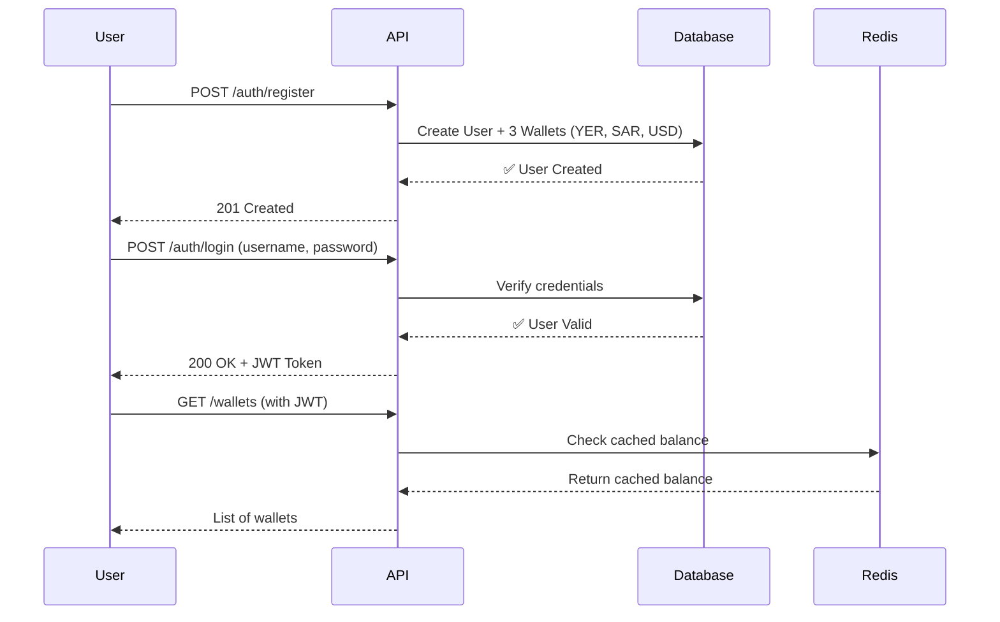

# 🚀 Getting Started with E-Wallet

> **For Beginners**: This guide explains everything from scratch. If you're new to Spring Boot or Docker, start here!

---

## 📚 Table of Contents

1. [What is This Project?](#what-is-this-project)
2. [Prerequisites](#prerequisites)
3. [Understanding the Project Structure](#understanding-the-project-structure)
4. [Step-by-Step: Running the Application](#step-by-step-running-the-application)
5. [How to View All Endpoints](#how-to-view-all-endpoints)
6. [Testing the Application](#testing-the-application)
7. [Understanding the Flow](#understanding-the-flow)
8. [Troubleshooting](#troubleshooting)

---

## 🎯 What is This Project?

This is a **Fintech E-Wallet** application built with Spring Boot. It allows users to:

- Register and login securely (JWT authentication)
- Store multiple currency wallets (YER, SAR, USD)
- View balances and transaction history
- (Coming soon: Transfer money, deposit, withdraw)

**Technology Stack:**

- **Backend**: Java 17 + Spring Boot
- **Database**: PostgreSQL (stores user data, wallets, transactions)
- **Cache**: Redis (speeds up balance lookups)
- **API Documentation**: Swagger UI (interactive API testing)

---

## ✅ Prerequisites

Before you start, make sure you have these installed:

| Tool                    | Purpose                | Download Link                                               |
| ----------------------- | ---------------------- | ----------------------------------------------------------- |
| **Java 17 or 21 (LTS)** | Run the application    | [Download Adoptium](https://adoptium.net/temurin/releases/) |
| **Docker Desktop**      | Run PostgreSQL & Redis | [Download](https://www.docker.com/products/docker-desktop/) |
| **Git**                 | Clone the project      | [Download](https://git-scm.com/)                            |

> [!IMPORTANT]
> **Java Version:** You MUST use **Java 17 or Java 21 LTS**. Java 19, 20, 22, 23, or 24 (preview) will cause compatibility issues.
> If you encounter "class file version" errors, see **[JAVA_FIX.md](JAVA_FIX.md)**.

**To verify installation:**

```powershell
java -version    # Should show Java 17 or 21
docker --version # Should show Docker version
```

---

## 📂 Understanding the Project Structure

The project follows **Clean Architecture** (also called Hexagonal Architecture):

```
src/main/java/com/fintech/ewallet/
├── identity/           # User registration, login, authentication
│   ├── domain/         # Business logic (User, KycStatus)
│   ├── application/    # Use cases (RegisterUser, LoginUser)
│   ├── api/            # REST endpoints (AuthController)
│   └── infrastructure/ # Database (JPA entities, repositories)
│
├── wallet/             # Wallet management system
│   ├── domain/         # Business logic (Wallet, LedgerEntry)
│   ├── application/    # Use cases (CreateWallet, GetBalance)
│   ├── api/            # REST endpoints (WalletController)
│   └── infrastructure/ # Database adapters
│
└── shared/             # Shared utilities
    ├── config/         # Security, JWT, Swagger configuration
    └── exception/      # Custom exceptions
```

**Key Concept**: Each feature (identity, wallet) is self-contained. This makes it easier to understand and test.

---

## 🏃 Step-by-Step: Running the Application

### Step 1: Start Docker Services

The application needs PostgreSQL (database) and Redis (cache) to run. Docker makes this easy.

**Open PowerShell in the project folder and run:**

```powershell
docker-compose up -d
```

**What this does:**

- ✅ Downloads PostgreSQL and Redis images (first time only)
- ✅ Starts both services in the background
- ✅ Creates a database called `ewallet_dev`

**Verify it's running:**

```powershell
docker ps
```

You should see two containers: `ewallet-postgres` and `ewallet-redis`.

---

### Step 2: Run the Spring Boot Application

**In PowerShell, run:**

```powershell
$env:SPRING_PROFILES_ACTIVE="dev"
./mvnw spring-boot:run
```

**What happens:**

1. Maven downloads dependencies (first time only)
2. Compiles the code
3. Flyway runs database migrations (creates tables)
4. Spring Boot starts the web server on port `8080`

**You'll see logs like:**

```
Flyway migration completed successfully
Started EwalletApplication in 12.5 seconds
```

**If you see this message, the app is ready!** 🎉

---

## 🌐 How to View All Endpoints

### Option 1: Swagger UI (Recommended for Beginners)

**Open your browser and go to:**

👉 **http://localhost:8080/swagger-ui.html**

**What you'll see:**

- All available API endpoints listed by category
- Input/output examples
- A green **"Authorize"** button (for JWT authentication)

**Screenshot guide:**

```
┌─────────────────────────────────────┐
│  Fintech E-Wallet API               │
│                                     │
│  🔒 Authorize ←── Click here first! │
│                                     │
│  ▼ auth-controller                  │
│    POST /api/v1/auth/register       │
│    POST /api/v1/auth/login          │
│                                     │
│  ▼ wallet-controller                │
│    GET  /api/v1/wallets             │
│    GET  /api/v1/wallets/{id}        │
└─────────────────────────────────────┘
```

### Option 2: Look at Controller Files

All endpoints are defined in `*Controller.java` files:

**Authentication Endpoints:**

- File: `src/main/java/com/fintech/ewallet/identity/api/AuthController.java`
- Endpoints:
  - `POST /api/v1/auth/register` - Create account
  - `POST /api/v1/auth/login` - Get JWT token
  - `POST /api/v1/auth/logout` - Invalidate token

**Wallet Endpoints:**

- File: `src/main/java/com/fintech/ewallet/wallet/api/WalletController.java`
- Endpoints:
  - `GET /api/v1/wallets` - List my wallets
  - `GET /api/v1/wallets/{id}` - Get balance
  - `GET /api/v1/wallets/{id}/transactions` - Transaction history

---

## 🧪 Testing the Application

### Using Swagger UI (Easiest)

**Step 1: Register a User**

1. Go to `http://localhost:8080/swagger-ui.html`
2. Expand **auth-controller**
3. Click `POST /api/v1/auth/register`
4. Click **"Try it out"**
5. Fill in the JSON:
   ```json
   {
     "username": "testuser",
     "phoneNumber": "+967777123456",
     "password": "Test@1234",
     "email": "test@example.com",
     "firstName": "Test",
     "lastName": "User"
   }
   ```
6. Click **Execute**
7. ✅ You should see `201 Created`

**Step 2: Login**

1. Click `POST /api/v1/auth/login`
2. Click **"Try it out"**
3. Fill in:
   ```json
   {
     "username": "testuser",
     "password": "Test@1234"
   }
   ```
4. Click **Execute**
5. **Copy the `accessToken`** from the response

**Step 3: Authorize**

1. Click the green **🔒 Authorize** button at the top
2. Paste your token (just the token value, no "Bearer")
3. Click **Authorize**, then **Close**

**Step 4: Test Wallet Endpoints**

1. Expand **wallet-controller**
2. Click `GET /api/v1/wallets`
3. Click **"Try it out"**, then **Execute**
4. ✅ You should see 3 wallets (YER, SAR, USD) with zero balances

---

### Using cURL (For Advanced Users)

See `TESTING.md` for detailed cURL commands.

---

## 🔄 Understanding the Flow

Here's what happens when you use the app:



**Key Points:**

1. **Registration** automatically creates 3 empty wallets
2. **Login** gives you a JWT token (valid for 1 hour)
3. **All wallet endpoints** require the JWT token
4. **Balances are cached** in Redis for fast access

---

## ❓ Troubleshooting

### Problem: "Port 8080 already in use"

**Solution:**

```powershell
# Find the process using port 8080
netstat -ano | findstr :8080

# Kill it (replace PID with the number from above)
Stop-Process -Id <PID> -Force
```

### Problem: "Connection refused to PostgreSQL"

**Solution:**

```powershell
# Check if Docker containers are running
docker ps

# If not, start them
docker-compose up -d
```

### Problem: "Flyway validation failed"

**Solution:**

```powershell
# Reset the database
docker-compose down -v
docker-compose up -d
```

### Problem: Can't see Swagger UI

**Make sure:**

1. ✅ Application is running (`mvnw spring-boot:run`)
2. ✅ No errors in the console
3. ✅ Visit `http://localhost:8080/swagger-ui.html` (not `.../swagger-ui/`)

---

## 📖 Next Steps

- **For API Testing**: See `TESTING.md` for detailed cURL examples
- **For Architecture Details**: See `PHASE_2.md` for design decisions
- **For Development**: See the `src/` folders for code structure

Happy coding! 🚀
